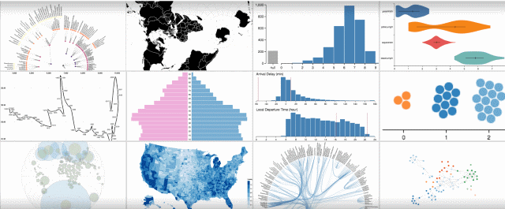

---
title: Gramex Charts
prefix: Charts
...

[TOC]

Gramex is agnostic to client-side charting libraries. Here are a set of
recommended libraries.

## Vega

[Vega](http://vega.github.io/vega/) is a high-level implementation of the grammar
of graphics, allowing the creation of charts with the power of D3 but with
greater ease.

Here is a [gallery of Vega charts](gallery.html) you can use as a starting point.

To learn Vega, read the [Vega tutorial](http://gramener.github.io/vegatutorial/).

## D3

[D3](https://d3js.org/) is a powerful low-level JavaScript library that can bind
visual features to data, allowing creation of custom charts.

## Gramex Charts

[Gramex Charts](https://learn.gramener.com/gc) is a Gramener JavaScript charting
library aimed at creating extensible visualizations. It is designed keeping these principles in mind:

- Charts are **REACTIVE**. If called repeatedly, they must update, not add / rebuild.
- Charts are **BOUND**. Multiple charts can be bound to a dataset and vice versa.
- Charts are **RESPONSIVE**. They resize with their container.
- Charts are **INSPECTABLE**. They expose their internals as properties.
- Charts are **EXTENDABLE**. They only add container nodes (e.g. `<g>`) in the data join, allowing any other elements to be added afterwards.
- Charts are **MODIFIABLE**. Chart internals are available. Developers can externally modify the chart attributes
