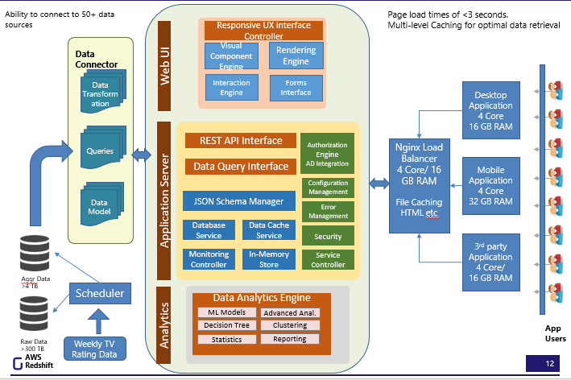
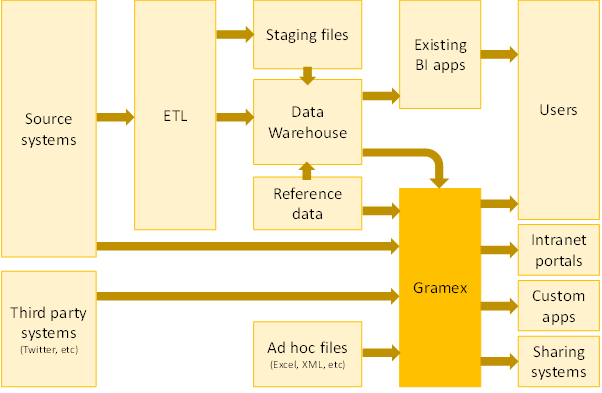
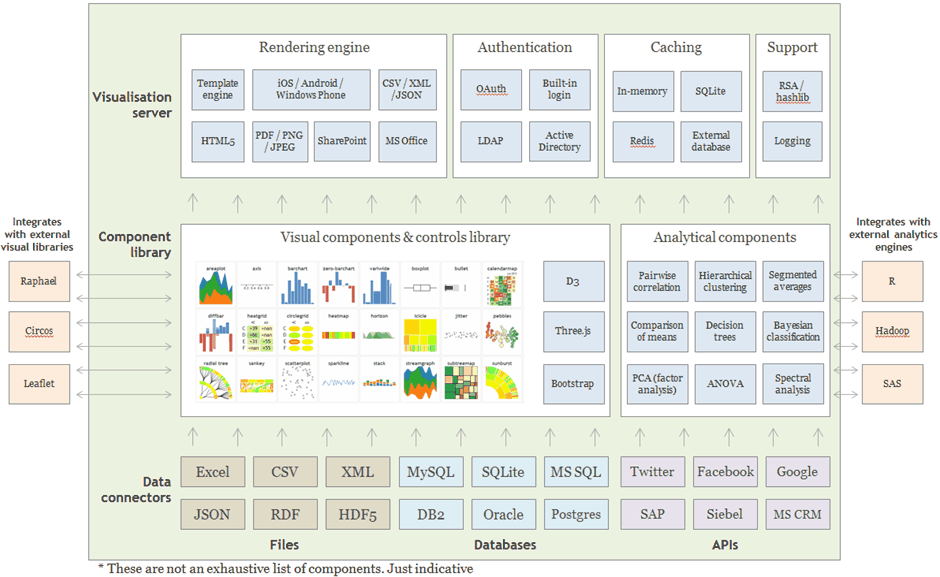

[TOC]

## Integration

### What databases does Gramex support?

Gramex can read data from all relational and most on-relational databases, including:

- Relational databases
    - Amazon Redshift
    - Firebird
    - IBM DB2
    - Microsoft SQL Server
    - MonetDB
    - MySQL
    - Oracle
    - PostgreSQL
    - SQLite
    - Sybase
    - Teradata
- Non-relational databases
    - Amazon DynamoDB
    - Azure CosmosDB
    - Cassandra
    - CouchDB
    - ElasticSearch
    - Google BigQuery
    - Hadoop HDFS
    - HBase
    - MongoDB
    - Redis
    - Spark

In addition, Gramex can read from all databases that support an ODBC interface
and are compliant with SQLAlchemy standard.

### What input file formats does Gramex support?

Gramex can read from the following file formats:

- CSV
- Excel (XLS, XLSX)
- HDF5
- HTML
- JSON
- Msgpack
- SAS
- Stata

Gramex can also read from any file format that has a Python reader library.

**What output formats does Gramex support?**

Gramex can render data and visuals into the following formats:

- Data formats
    - CSV
    - Excel (XLS, XLSX)
    - JSON
    - XML
- Visual formats
    - HTML
    - PPTX
    - PDF
    - Images (PNG, JPG, GIF)
- Container formats
    - Web pages
    - AJAX
    - IFRAME
    - Mobile UIView / WebView

### What applications does Gramex integrate with out-of-box?

Gramex integrates with social media applications out-of-box. Specifically
Twitter, Facebook and Google.

Gramex can also access the data from applications either directly via the
database or via a data dump. This includes:

- ERP applications (e.g. SAP, Oracle JD Edwards, etc)
- ITSM applications (e.g. ServiceNow, BMC Remedy, etc)
- RPA applications (e.g. AutomationAnywhere, BluePrism, etc)

### How does Gramex integrate with R?

Gramex leverages R’s analytical capability natively without sacrificing its
advantages of speed and out-of-memory processing. This is achieved through:

- **Interoperable data structures**. All computations use DataFrames, which is
  compatible between R and Gramex. The same object can be used by both
  applications with minimal translation
- **Transparent programmatic controls**. Gramex natively connects to the R
  libraries using the R runtime API and executes commands on the R environment
  in a manner identical to how scripts operate. Python scripts in Gramex
  manipulate R objects using R functions directly.
- **Source reuse**. Gramex can run scripts in R as well. So existing R scripts
  can be re-used. Additional computations can be written as R scripts and
  executed in R by Gramex.

A typical workflow with R involves:

- Gramex handling the data sourcing and heavy data crunching – specifically
  filtering and aggregating the dataset into a computationally ready DataFrame
- R scripts analyzing the data to create models and predictions
- Gramex merging results back into raw data and rendering these as visual
  analytic dashboards

The process allows independence of development. Developers changing the R scripts need not be aware of the Gramex environment, and vice versa.

## Deployment

### How are Gramex applications deployed?

Each Gramex instance runs on a single core. and we recommend reserving a core
for the server. So if you run 8 Gramex instances, it can be on a single 8-core
server, or two 4-core servers, and so on.

Gramex applications, or templates, can run on one or more instances of Gramex.
Depending on the size of data and number of users, you have 3 options for
deploying a new Gramex application:

1. Run it on an existing Gramex instance. This is preferred for very small
   applications, with the same audience and security needs as existing
   applications.
2. Run it on a new Gramex instance. This is ideal for most applications.
3. Run it across multiple Gramex instances. This is required for applications
   with large datasets or large user bases.

### Where does it fit in my enterprise’s architecture?

Gramex applications fit alongside your existing BI applications.

Gramex sources data from a variety of sources:

1. **Source systems.** If the source transaction system exposes an API to pull
   data from, and/or is a popular system that Gramex has a connector to (e.g.
   SAP), data can be accessed directly from the source system.
2. **Third party systems.** Data from any external system that provide an API
   can be imported into Gramex in real-time.
3. **Data warehouse.** If your organization has a data warehouse, that is the
   preferred way of accessing data. This ensures that the data is consistent
   with the other applications – including BI applications – that are sourcing
   data from the warehouse.
4. **Ad hoc files.** Often, organizations have spreadsheets that contain
   transaction or reference data that are maintained outside of source systems.
   These can be accessed by Gramex as well.

The server that hosts Gramex is typically housed in the same network as the
systems that it accesses data from.

Gramex also feeds a number of applications. Apart from end users who can consume
the visuals directly from its web interface, or via mobile, the output can also
be fed into:

1. **Intranet portals.** The visualizations can be embedded as part of an
   existing web application (SharePoint, for example) in a seamless manner
2. **Custom applications.** The visuals can be rendered as part of a native
   mobile application, as part of an Excel model, inside a Flash or a Java
   application, and so on.
3. **Sharing systems.** The output of these visuals can be fed into a
   distribution system such as email, shared folders, collaboration software,
   etc.

### What environment is required for Gramex applications?

- **Cores**: For deployment, it’s best to plan to run Gramex application on a
  single separate Gramex instance. This ensures that the data, authorisations
  and processing capacity is kept independent.
    - **Multiple apps on one instance:** In some cases, where the same set of
      users require a new application that runs off the same data, the new
      application can also run on the same instance. For example, if the Finance
      team already has a receivables dashboard, and want to add a receivables
      forecaster or a receivables fraud identifier visualization, these can be
      run on the same Gramex instance.
    - **Multiple instances for an app:** If an application has a large number of
      concurrent users or needs to do a lot of computation, it may need to run
      on multiple instances. As a rule of thumb, you would need at least 1
      additional instance for every 200 concurrent users, and 25 concurrent
      users is a typical figure achieved in real-life deployments. The nature of
      computation varies from application to application, and it is best to
      speak to someone from Gramener about sizing an application.
    - A rule of thumb of 1 instance (= 1 core) per app is reasonable. But it is
      important to have at least 1 core to spare on each server – i.e. don’t run
      Gramex on every core.
- **RAM**: The volume of data that needs to be processed need not fit in RAM.
  Gramex has the ability to use a streaming process to create aggregates of
  large volumes of data, reducing the volume of RAM required. However, the
  aggregates do need to fit in memory. While the volume of RAM varies from
  application to application, we recommend setting aside **16GB of RAM** per
  app. For more data intensive ones, this may go up to 64GB of RAM, but rarely
  more than that.
- **Disk**: The volume of disk space is directly proportional to the volume of
  data. It is best to plan for twice as much disk space as the expected volume
  of data in 3 years. For example, if your data is likely to be 1TB large in 3
  years, it’s best to set aside 2TB, to ensure that all computations and
  temporary storage are taken care of. Most applications that we see require
  less than 100GB of storage space. We recommend setting aside **100GB of
  storage per app.**
- **Servers**: Putting these together, we need 1 core, 16GB RAM and 100GB disk
  space for a typical app. Thus, for 8 applications, this would be 8 cores,
  128GB and 800GB. This can be housed on a single large server, or spread across
  multiple servers. However, there are two reasons why these are typically
  spread out:
    1. **Risk mitigation.** If one server fails, the other applications are
       still live.
    2. **Compartmentalization.** You may not want the administrators of one
       application to inadvertently access data from another.

We’ve often found that our clients use **one server per department** that
consumes these visualizations.

In addition to a production server, a test server with a configuration similar
to the production server is required. This needs to be live for the duration
that the project is under development, but can be reused for other projects
later.

While Gramex applications are built, Gramex needs to be installed on the systems
the developers are working on. The hardware specifications for development
systems are not stringent. Any available system would

#### Example Hardware Requirements

Here are some examples of hardware requirements.

If you were building just **one normal Gramex application**, you’d probably need:

- One production server: A dual core CPU with 16GB RAM and 100GB free disk space
- One test server: A dual core CPU with 16GB RAM and 100GB free disk space
- Development systems: one per developer. Any system is fine

If you plan to build **eight Gramex applications** across 4 departments (two
applications per quarter), you’d probably need:

- Four production servers (one per department) with 4 cores, 32GB RAM, 200GB free disk space
- Two test servers (one for each app being developed in parallel) with 4 cores, 32GB RAM, 200GB free disk space
- Development systems: one per developer. Any system is fine

### What does the Gramener Architecture look like?

This is a component architecture of Gramex.

### How does Gramex load and store data?

Gramex uses has two data sourcing mechanisms:

1. **Querying.** If the source system that Gramex gets data from provides a
   querying mechanism, Gramex can query the system for data as required. This
   allows the data to reside in the source system, without a permanent copy on
   Gramex.
2. **Loading.** If data volumes are large, or if the source system does not
   permit querying readily, data can be extracted in bulk and loaded into
   Gramex.

The choice of method varies based on the use (for example, querying is better
for reporting, while loading is better for analytics) as well as the nature of
data and source systems.

When data is loaded into Gramex, several options for internal storage are
available. Gramex can be configured to use:

1. An internal in-memory database-like structure (the most common option for small data)
2. An external database (SQLite, Oracle, SQL Server, etc - the most common option for large data)
3. An external in-memory database (Redis, for example)
4. An external file (CSV, XML, HDF5, etc)

### How does Gramex transform data?

When data is **queried**, most transformations and processing happen on the
source system. For example, if the source system is a database, the SQL query
handles the bulk of the data transformation. Gramex performs minimal
post-processing required for analytics or reporting.

When data is **loaded**, all transformations and processing happen within
Gramex, in-memory. This requires higher processing power and RAM on the system
that Gramex is housed in, but reduces the load on the source systems.

### How is data backed up?

Gramex applications by themselves do not act as a master for data. It is a
processing system. Therefore, there is no need to backup the data in Gramex. Any
transaction data, including user-generated comments, etc. are written back to a
database that can be backed up as per your enterprises backup policy.

If the Gramex server is destroyed, it can be reinstalled and re-run. The Gramex
application will automatically re-calculate all the values and re-creates the
visuals.

### How is the Gramex source code maintained and updated?

Gramex follows twice a month release cycle . Enterprises that purchase a Gramex
license have the option of upgrading to a newer version. While newer versions of
Gramex are mostly backward compatible and tested, there may be a cycle of
deprecation of features. So we strongly urge a test phase before deploying a new
version, to ensure that existing templates are compatible with it.

When developing a new application, using the latest version of Gramex is ideal,
since it provides the latest features, and has the benefit of going through a
test cycle in any case.

When the application template needs to be modified, a revised set of template
files will be deployed first on the test server. Once all tests pass, these are
deployed on the production server, overwriting the prior template. This may
require restarting the Gramex instance (but not the server itself.)

### How much data volume can Gramex handle?

Gramex can theoretically handle an unlimited volume of data when processing is
delegated to an external engine. For in-memory processing, Gramex can handle up
to 64 TB of data.

Typical Gramex projects involving large scale data process data in the terabyte scale.

### How many users can Gramex handle?

Gramex can serve up to 450 requests per second per instance. This may reduce
based on the complexity of the response. This can be increased with multiple
instances serving the same application.

There are no hard limits to the number of concurrent users an application can
serve. The largest volume of requests Gramex has handled was during the 2014
Indian Elections when the application handled 11 million requests over 8 hours
with over 400 concurrent requests per second at its peak.

### What testing do Gramex applications go through?

Gramener provides a secure testing environment for applications at
[UAT](https://uat.gramener.com/). Access is provided to authorized client roles
for feedback on the application design and development. Gramener’s QA team
performs the following types of tests:

- UI test
- Functional and non-functional test
- Authentication test
- Data validation test
- Cross browser test
- Business/use-case test
- Usability test
- Security test

### Gramex Deployment Manual - Windows Server

Gramex installation will be provided to clients as a single .msi file. The
single file will incorporate all the required installation modules for Gramex
and the custom Solution.

1. Administrative permission is required to install the package.

2. Gramex can start/stop/restart via Windows Event Service. The events are added to the list during the Gramex installation.
3. The default installation folder can be changed to meet the client need.
4. Gramex upgrades are provided to client via a new .msi file. The new file has to be swapped with the prior version. The current solution will unavailable during the upgrade process. The installation will result in a downtime for the current solution.
5. Custom packages are upgraded and managed via versioning of .msi file.
6. Changing server resources will not have any impact as long as there it does not result in downtime of the solution.
7. When there is a server downtime the solution will not be available for use.

## Security

### Does Gramex have a Policy that prohibits sharing of individual accounts and passwords?

Gramex can restrict the number of concurrent sessions. When a new session is
created, all other sessions created for the user can be disallowed.

### How does Gramex encrypt password?

By default passwords are encrypted via SHA-256. Gramex can be configured to
choose from a number of algorithms including - DSA, RSA, DCDSA, SHA-512, AES,
Blowfish etc;

### What password policies does Gramex support?

Gramex supports:

- Custom password rules, such as minimum length, mix of alphabets/numbers/symbols, consecutive character limits, start with rules
- Disallowed passwords list
- Password strength check (e.g. no user ID, no common words, etc)
- Disallowed password history (no reuse of last n passwords)
- Password change history
- Password expiry duration / password ageing
- Automatic secure password generation
- Changing password on first login
- Admin reset of password
- Password recovery mechanism
- Configurable session expiry
- Restricting number of sessions (e.g. disconnect if logged in on 2 devices) etc.

### Does Gramex use HTTP POST method when transmitting authentication credentials over HTTP?

Yes. All authentication requests are transmitted via HTTP POST by default.

### Does Gramex enforce enabling SSL on landing pages that have authentication function?

Yes. Some clients have requested a deployment on non-SSL-enabled environments.
In such cases, the platform also provides a flexibility to disable SSL
enforcement if required.

### How does Gramex defend from Cross-site Request Forgery (CSRF) attacks?

Gramex requires all form requests to hold an XSRF token generated by the server.
This token is validated by the server before performing any operation.

### How does Gramex defend from Cross-site Scripting (XSS) attacks.?

Gramex sets an `X-XSS-Protection: 1` HTTP header by default. Browsers prevent
cross-site scripting when this header is encountered.

### How does Gramex defend from Cross-frame Scripting (XFS) attacks?

Gramex sets an `X-Frame-Options: SAMEORIGIN` HTTP header by default. This prevents Gramex content from being placed inside another frame.

### How does Gramex defend from header injection attacks (e.g. CRLF)?

Gramex disallows any HTTP header with invalid values, specifically characters in
the range of 00 to 1F (hex), which includes CR and LF.

### How does Gramex defend from URL redirection attacks?

Gramex disables external redirects by default. By default, applications may only
redirect within the same host. This prevents malicious hosts from taking
control.

### How does Gramex defend against brute force login attacks?

Gramex slows down its responses on repeated login failures. This limits the
number of password guesses that can be made. The rate of slowdown is
configurable.

### How does Gramex defend from directory traversal attacks?

Gramex normalizes file access requests and rejects user access to any file
outside the sandboxed deployment environment. Files outside the application
folder cannot be accessed by the user.

### Does Gramex expose any private object references (e.g. primary keys)?

Gramex does not expose any primary keys by default. Applications can be
configured to expose non-sensitive primary keys.

### How does Gramex manage Digital certificates and their authentication?

Gramex secures access to digital certificates using OS-level encryption / access
restrictions. For example, on Linux, digital certificates are stored in a secure
directory with access restricted to applications using ACL via AppArmor or
similar security infrastructure.

### How does Gramex handle Encryption keys. Elaborate on creation, regeneration, transmit mechanism?

Gramex uses encryption keys for cookies, HTTPS certificates, etc. These are
generated by administrators outside of Gramex. They are stored outside the
Gramex environment, e.g. as environment variables, secured files, etc. Gramex
uses these keys to encrypt / decrypt content that is typically transmitted over
HTTPS / SSL.

### How does Gramex handle network (data-in-transit) security and storage (data-at-rest) security?

Gramener applications delegates the encryption and decryption of data to
specialized algorithms suited for this purpose. A typical application
environment would have the following setup:

- Network security
    - Bulk data transfer is encrypted via SSH (RSA or ECDSA).
    - End-user data transfer is encrypted via HTTPS, which overlays SSL/TLS on
      top of HTTP.
- Password security
    - Passwords are salted and encrypted using a one-way hashing algorithms
      (e.g. SHA-256)
    - One-way encryption of any data is enabled via SHA-256 by default
    - Reversible encryption is optionally supported via the RSA algorithm
- Storage security
    - Gramex applications do not to persist computations. These happen
      in-memory. Local caches and results are also in-memory unless explicitly
      designed otherwise.
- LAN security
    - Gramex does not automatically extract data from sources via file or port
      scanning. Data must be pushed to the application, or explicit permissions
      must be granted.

### What is Gramex’s logging mechanism? What information is captured? Who can access the logs?

Gramex logs the following information on any access:

- Time of access
- IP address of the user
- ID of the user (e.g. email ID, LDAP login ID, etc)
- Method of access (e.g. HTTP GET, POST, etc)
- Resource accessed
- Status of the response (e.g. success, failure, etc)
- Trace of error event, if applicable E.g.
    - Data access errors
    - Application configuration errors
    - Missing resource errors
- Duration of response

This information is accessible to administrators of the system Gramex is
deployed on.

Logs are rotated at a configurable interval, e.g. hourly, daily, weekly etc. The
duration of log retention is configurable and only limited by system disk space.
These can be backed up / archived using a standard file backup mechanism.

### Does Gramex log any confidential and sensitive personal information like government issued IDs, passwords etc.

The fields mentioned in above question are logged, no additional information is
logged. If any of the logged fields are deemed sensitive, they can be configured
to remove from the log.

### What anti-virus protections does Gramex provide or use?

Gramex relies on anti-virus software deployed on the underlying OS. It is
compatible with all anti-virus software, and can be deployed with the antivirus
choice of clients.

### Describe the session management approach

Gramex creates a time-bound encrypted session token on any request. Tokens are
encrypted using SHA-256. The encrypted tokens are stored on the client side as
expiring cookies on the browser with the HttpOnly and Secure flags enabled, and
restricted by domain and path as required. On the server-side, session tokens
are stored in database with protection configurable by the administrator.

The expiry duration is controlled by the application. Cookies are validated for
expiry by the server on every request. Expired cookies are purged. The user is
presented with a new session with no credentials associated with it.

### What authentication mechanisms does Gramex support?

Gramex supports [simple authentication](../auth/#simple-auth) and
[Google authentication](../auth/#google-auth).

Gramex Enterprise supports a [built-in ID & password-based](../auth/#db-auth)
authentication mechanism. It also integrates with these federated authentication
mechanisms:

- [LDAP](../auth/#ldap-auth) (implemented by Microsoft Active Directory, Apache
  Directory, FusionDirectory, etc)
- [OAuth 2.0](../auth/#oauth2) (implemented by Google, Twitter, Facebook,
  Microsoft, etc)
- [Kerberos](../auth/#integrated-auth) (implemented by Windows Domain Server,
  Internet Information Server, etc)
- [SAML](../auth/#saml-auth) (implemented by Microsoft ADFS, CA Single Sign-On,
  Citrix Open Cloud, Oracle Identity Federation, Tivoli Federated Identity
  Manager, etc.)
- [SMS Auth](../auth/#sms-auth)
- [Email Auth](../auth/#email-auth)

### Does Gramex support two-step registration process or two-step authentication?

No. Gramex does not support two-factor authentication natively built-in.
However, Gramex works with single-sign-on (SSO) engines that support two-factor
authentication using protocols such as LDAP, OAuth 2.0 and SAML. 2FA based on
SMS verification can be customized if required

### Does Gramex support automatic login function (remember me function to store credentials)?

Yes. Gramex stores user login information against a secure session cookie with a
configurable expiration time.

### How does Gramex restrict access based on business purpose? Does Gramex support authorization control for functions or services?**

Yes. Gramex controls access to all resources via a configuration editable by the
administrator. The configuration defines the conditions under which a user can
access the resource, e.g.

- User’s role matches a set of valid roles
- User’s email ID / LDAP ID matches a set of regular expressions
- User’s LDAP organization matches a list of allowed organizations
- etc.

In addition, Gramex applications have the ability to expose different content
based on the user’s role. For example, managers may be able to view the total
sales of their entire team, while an agent may only be able to view their own
sales.

### What are the role-based access controls that are supported by Gramex? Are there any default roles or default permissions?

Gramex is used to build applications that allow any kind of role-based access
control mechanisms to be implemented. There are no pre-defined roles.

### How are Gramex applications audited for security compliance?

Gramener runs industry standard security audit tools such as OWASP Zed Attack
Proxy on applications before deployment. Clients may run their security tests on
the application as well prior to deployment. Application are deployed only after
relevant security issues are resolved.

### What open source libraries and licenses does Gramex use?

Gramex uses open source components that are licensed under one of these licenses:

* [Python Software Foundation license](https://opensource.org/licenses/Python-2.0)
* [MIT license](https://opensource.org/licenses/MIT)
* [BSD license](https://opensource.org/licenses/BSD-3-Clause)
* [LGPL license](https://opensource.org/licenses/LGPL-3.0)
* [Apache software license](https://opensource.org/licenses/Apache-2.0)

The [full list of libraries is here](../license/thirdparty.md).
