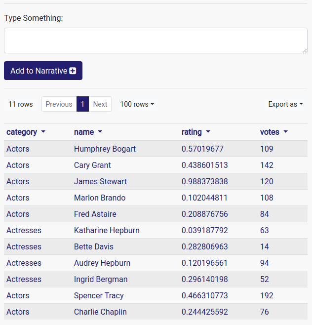
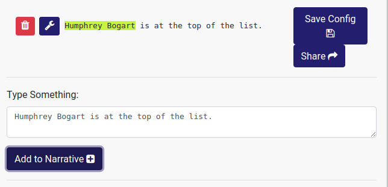

---
title: Natural Language Generation
prefix: Natural Language Generation
...

[TOC]

From v1.54, Gramex includes a Natural Language Generation component. The NLG app
is a smart template creator which:

1. Automatically creates tornado templates from English text in the context of a dataset.
2. Allows for modification and generalization of these templates.
3. Renders these templates as a unified narrative.

To use it, add the following to your `gramex.yaml`:

```yaml
import:
  nlg:
    path: $GRAMEXAPPS/nlg/gramex.yaml
    YAMLURL: $YAMLURL/nlg/
    auth:
      login_url: /$YAMLURL/login
```

This configuration mounts the app at [nlg/](nlg/): <!--TODO: Fix link -->

<div class="example">
  <a class="example-demo" href="/">NLG</a> <!-- TODO: Fix link -->
  <a class="example-src" href="http://github.com/gramener/gramex/blob/master/gramex/apps/guide/nlg/gramex.yaml">Source</a>
</div>

## The NLG Component

The NLG component depends on two sources of information:

1. A source dataset, which can be uploaded on the [landing page](nlg/).
   A dataset is uniquely identified with its filename. Once
   uploaded, the file persists and is available for selection from the landing
   page. Any *file* that makes a valid URL for
   [FormHandler](http://learn.gramener.com/guide/formhandler) can be used with
   the NLG app.
2. A _narrative_, which is a collection of templates and rules around them.
   The narrative consists of the configuration which governs the rendered text.
   An existing narrative can be uploaded through the landing page, or can be
   created through the [NLG IDE](nlg/index). Once created, the narrative can be
   named and becomes available for selection from the landing page.

## The NLG IDE

The primary purpose of the IDE is to create or edit narratives based on a
dataset. Once a dataset has been selected, it is exposed in the IDE as a
[FormHandler table](https://learn.gramener.com/guide/formhandler/#formhandler-tables).



Users can now type English text into the IDE and add it to the narrative. This
automatically templatizes the text, and adds the template to the narrative. For
example, typing "Humphrey Bogart is at the top of the list." does this:



This means that the input statement has been templatized and added
to the narrative. The part of the input text that was successfully templatized
is highlighted in green. Clicking on the spanner button next to a template opens
the [Template Settings] modal.


## Template Settings


This dialog provides configuration options for all template attributes:

1. **Template Name** - Each template can optionally be named.
2. **Condition** - Any Python expression which evaluates to a boolean may be set as
   a condition, which controls whether the template is rendered.
3. The actual Tornado template itself can be edited. Any valid Tornado template
   is acceptable.
4. **Token Settings** - Every token from the input text that finds a match in
   the dataset or in FormHandler arguments (i.e. every token that is highlighted
   in the preview) is converted into a
   [template expression](https://www.tornadoweb.org/en/stable/template.html#syntax-reference).
   Such tokens have their own attributes, as follows:
    - **Token search results** - if a token is found in more than one place (say, a
      dataframe cell as well as a FormHandler argument), this setting allows the
      user to select the right result.
    - **Grammar options** - the NLG engine may automatically apply certain
      string formatting or lexical operations to the template expression to make
      it match the input text. Any number of these operations can be enabled /
      disabled through this setting.
    - **Make variable** - a token may be set as a local variable within the
      template.
    - **Ignore** - the template expression corresponding to the token may be
      ignored, and set back to the literal input text.
5. **Run Template** - Run the current template against the dataframe and preview
   its output.
6. **Save Template** - Save the template. Note that this is required if the
   template has been manually edited in the textarea.


## Naming and Saving a Narrative

Once a narrative has been fully configured, it can be named and saved. Doing so
causes it to appear the narrative dropdown menu on the landing page.


## Sharing a Narrative

After a narrative has been named and saved, it be shared in two modes:

1. **IDE mode** - This option lets users copy a URL that redirects to the
   IDE, with the current dataset and the current narrative set in the session.
2. **Embed mode** - Copy an HTML snippet to embed into a page which contains a
   Formhandler table. The template will render live as the table changes.