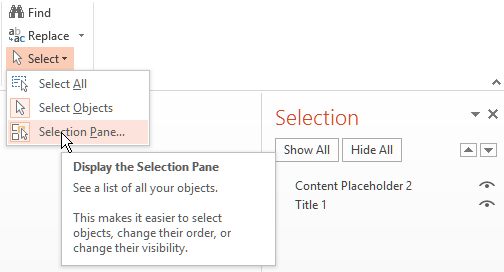

---
title: PPTXHandler generates PPTX
prefix: PPTXHandler
...

New in **v1.23**. [PPTXHandler][pptxhandler] creates PPTX files using a configuration and an
existing PPTX as a template. The result is a new PPTX that the user can download.

Here is an example of a simple text substitution:

    :::yaml
    url:
      pptxhandler/ppt:
        pattern: /$YAMLURL/ppt
        handler: PPTXHandler
        kwargs:
          only: 1
          source: $YAMLPATH/input.pptx    # Input file to load
          change-text:                    # First rule is called change-text
            Title 1:                      #   Find all shapes named "Title 1" in all slide number 1
              text: Generated by Gramex   #   Replace their text
          headers:
            Content-Disposition: attachment; filename=output.pptx

[Run example](ppt)

Note: all examples use specific slides from [examples-input.pptx](examples-input.pptx)

The rules are based on the [PPTGen API](#pptgen) which is described below.

# PPTGen

PPTGen lets you modify the contents of a PowerPoint presentation based on data.
For example, you can:

- Update charts, images and text from data
- Create a series of slides using a template from spreadsheets or database

It is a command line utility and a Python function packaged with Gramex.
It forms the basis of PPTXHandler.

## PPTGen Library

The [PPTGen][pptgen] library accepts a configuration as its argument. For example:

    :::python
    from gramex.pptgen import pptgen
    pptgen(
      source='input.pptx',      # optional path to source. Defaults to blank PPT with 1 slide
      target='output.pptx',     # optional target. Otherwise, returns the pptx.Presentation()
      change={                  # Configurations are same as when loading from the YAML file
        'Title 1': {            # Take the shape named "Title 1"
          'text' 'New Title'    # Replace its text with "New Title"
        }
      }
    )

Here is another example that changes a bar chart based on data:

    :::python
    import pandas as pd
    from gramex.pptgen import pptgen
    data = {'chart_data': pd.read_csv('data.csv')}
    pptgen(
      source='input.pptx',
      target='output.pptx',
      edit_chart={
        'Bar Chart Shape Name': {
          'chart': {
            'data': data['chart_data'],
            'x': 'Category',
            'size': 'PreY',
            'color': {
              'function': "{'CurY': '#D73027', 'PreY': '#1A9850', 'PPresY': '#FFFFBF', 'Size': '#cccccc'}"
            }
          }
        }
      }
    )

# PPTGen Configuration

The configuration accepts the following top-level keys:

- `source:` required. Path to input / source PPTX.
- `target:` optional. Path where output / target PPTX is saved.
  If None, `pptgen` returns the Presentation object.
- `data:` optional dataset or a dictionary. This is described below.
- `only:` Accepts slide number or list of slide numbers starting from 1. If defined, in output presentation only selected slides will be available. Suppose there are 10 slides in a presentation but user has defined `1` under `only` section then only slide number 1 will be available in output, similarly slide number 1 and 2 will be available in output presentation if `only: [1, 2]`.
- `register:` Optional to register any new custom commands to pptgen. It accepts a function which accepts three parameter `shape`, `spec`, and `data`. Available `immutable` commands in pptgen are `css`, `text`, `image`, `chart`, `table`, `sankey`, `bullet`, `replace`, `treemap`, `heatgrid` and `calendarmap`.
- All other keys are treated as rules that are described below.

## Data

PPTGen can change presentations with data from various sources. It uses
`gramex.data.filter`. It supports these keys:

- `url:` Pandas DataFrame, sqlalchemy URL or file name
- `ext:` file extension (if url is a file). Defaults to url extension
- `args:` optional filters to apply to dataset. Passed as a dict of lists
- `table:` table name (if url is an SQLAlchemy URL)
- `query:` optional SQL query to execute (if url is a database)
- `transform:` optional in-memory transform. Takes a DataFrame and returns a DataFrame.
- Any additional keys are passed to `gramex.cache.open` or `sqlalchemy.create_engine`.

Example:-

    :::yaml
    data:
      cities: {url: cities.csv}                         # Load cities.csv into "cities" key
      sales: {url: sales.xlsx, sheet: Sheet1}           # Load Sheet1 from sales.xslx into "sales" key
      tweets: {url: tweets.json}                        # Load JSON data into "tweets" key
      sample: {url: mysql://server/db, table: sample}   # Load sample data from MySQL
      filter:
        url: cities.csv                                 # Load cities.csv
        args:                                           # Filter results
          Country: [Egypt, Sudan]                       # WHERE column Country is Egypt or Sudan
          Population>: 100000                           # AND column Population is 100,000+

## Rules

The configuration can define any number of rules. Rules have:

- one or more [shape names](#shapes), and the list of [commands](#commands) to
  apply to those shapes.
- an optional [slide selector](#slides) that restricts which slide they apply to.
  By default, rules apply to all slides.

In the example below, there is 1 rule called `change`. It does no slide selector,
so it applies to all slides. It has 1 shape: `Title 1` with 1 command: `text`:

    :::yaml
    source: input.pptx        # optional path to source. Default to blank PPT with 1 slide
    target: output.pptx       # required path to save output as
    change:
      Title 1:                # Take the shape named "Title 1"
        text: New Title       # Replace its text with "New Title"

[Run example](rules-example)

### Slides

By default, changes are applied to all slides. To restrict changes to a specific
slide, use:

1. `slide-number` slide number or list (with the first slide as slide 1).
1. `slide-title` is a regular expression that matches the slide title.

```yaml
source: input.pptx
target: output.pptx
rule-1:                 # rule-1 applies to all slides
  ...
rule-2:
  slide-number: 1       # rule-2 applies only to the first slide of the source
  ...
rule-3:
  slide-title: Hello    # rule-3 applies to slides with the title "Hello" (regex)
  ...
  ...
```

To create multiple slides from data, add `data:` to the change. For example:

    :::yaml
    data:
      sales: {url: $YAMLPATH/sales.csv}
    change:
      data: data['sales'].groupby('Category')
      replicate: True
      sales-text:                # Take the shape named "sales-text"
        data: data[0]
        text: "Region {{ Category }} has sales of {{ Sales }}"


[Run example](sales-example)

This `data:` is an [expression](#expressions) using the root `data:` variables.
It can be used with

- `slide-number` to repeat 1 or more slides. For example `slide-number: [1,2]`
  will copy slides 1 & 2 as many times as there are rows of data
- `slide-title` to repeat individual slides or multiple single slides

Slide numbers always refers to the source slide number, not the target slide
number. Even if a slide is duplicated in the target, source slide numbers do not
change.

### Shapes

In PowerPoint, all shapes have names. To see shape names, select Home tab >
Drawing group > Arrange drop-down > Selection pane. Or press ALT + F10.



To change the shape names, double-click on the name in the selection pane.

You can specify changes to one or more shapes in a [rule](#rules). For example:

    :::yaml
    rule-1:
      Title 1:                 # Shape name "Title 1" will be updated by text "New title"
        text: New title
        style:                 # Text color will be `red`(accepts only hex color code in 6 digit)
          color: '#ff0000'
      Text 1:                 # Shape name "Text 1" will be updated by text "New text"
        text: New text
        style:                 # Text color will be `green`(accepts only hex color code in 6 digit)
          color: '#00ff00'
          bold: True           # Text will appear in bold

... changes 2 shapes named `Title 1` and `Text 1`.

[Run example](text-style)

Shape names may refer to native elements or [groups](#groups).

### Groups

Shape names may refer to groups. To change groups' contents, use a nested
configuration. For example, if "Group 1" has "Caption" and "Picture" inside it,
this `config-group.yaml` replaces those:

    :::yaml
    source: input.pptx
    target: output.pptx
    change-image:
      Group 1:                        # Take the shape named "Group 1"
        Caption:                      # Find the shape named "Caption" inside it
          text: New caption           #   Change its text to "New caption"
        Picture:                      # Find the shape named "Picture" inside it
          image: $YAMLPATH/sample.png #   Replace the image with sample.png

[Run example](group-example)


## PPTX URL arguments

URL arguments can be used as variables in templates.

In the example below, [group-args-example?text=My-Text](group-args-example?text=My-Text),
will replace text with `My-Text`

    :::yaml
        Caption:                      # Find the shape named "Caption" inside it
          text: "{{ args['text'] }}"  #   Change its text to ?text=
        Picture:                      # Find the shape named "Picture" inside it
          image: $YAMLPATH/{{ args.get('image', 'sample') }}.png # Replace image with ?image= or sample.png

[Run example](group-args-example?text=My-Text)

## Commands

Shapes can be changed using 1 or more commands. These commands can change the
shape's style and content, or add new content (like charts).

### Register: Register a new command to PPTGen

Register let you create a custom command. It accepts a function which will accepts three parameters, `shape`, `spec`(configuration for a shape, config under the shape name), `data` in same order. It will not accept any other parameter except these 3. Any existing command can not be overwrite. Return an immutable command list.

    :::yaml
    source: input.pptx
    target: output.pptx
    data:
      load_data: {url: data.csv}
    register:
      custom_command1: view.custom_command1  # Registering a new command as `custom_command1.`
      custom_command2: view.custom_command2  # Registering a new command as `custom_command2.`
      custom_command3:
        function: view.custom_command3       # Registering a new command as `custom_command3.`

    custom-config:                           # Rule
      Shape Name 1:                          # Shape Name
        custom_command:
          ....    Configuration
      Shape Name 2:
        custom_command2:
          ....    Configuration
      Shape Name 3:
        custom_command3:
          ....    Configuration

### CSS

The following CSS-like commands change the shape's display attributes:

- `data`: Loads data
- `style`: Accepts css like properties

    - `opacity`: sets the shape's opacity level as a decimal from 0 - 1
    - `color`: sets the text / foreground color as CSS colors
    - `fill`: sets the shape's background color as CSS colors
    - `stroke`: sets the shape outline color as CSS colors
    - `width`: sets the shape width in points
    - `height`: sets the shape height in points
    - `left`: sets the shape X position in points
    - `top`: sets the shape Y position in points
    - `font-size`: sets the font size in points
    - `font-family`: sets the font family as a font name

Example:

    :::yaml
    Rectangle 1:            # Take the shape named "Rectangle 1"
      css:
        data: data['sales']
        style:
          opacity: 0.5
          color: '#ff0000'
          fill: '#ffff00'
          stroke: '#ffff00'
          width:  200
          height: 200
          left: 50
          top: 100

[Run example](css-example)

CSS colors can be specified in the same way they can in CSS.
1 point is 1/72 inches. All `style` elements and `data` will accept python expression or python function.

Values support [expressions](#expressions).

### Text

To change the title on the input slide to "New title", use this configuration:

    :::yaml
      Title 1:                # Take the shape named "Title 1"
        style:                # CSS like properties only for text
          color: '#ff00000'   # Text color will be red
          font-size: 12       # Setting font-size
          .......
        text: New Title       # Replace its text with "New Title"

[Run example](rules-example)

`text:` values support [templates](#templates). Also supports `style` css like properties for text under `shapename.style` section. All style `sub-elements` accepts `python functions` also.
`text:` supports `xml` objects in input text(which suppose to get replaced with) to have a `css` properties for a word in a sentence or phrase. `e.g.-`

    :::yaml
      Title 1:                # Take the shape named "Title 1"
        style:                # CSS like properties only for text
          color: '#ff00000'   # Text color will be red
          font-size: 12       # Setting font-size
        text: "New Title <text color="#00ff00" bold="True"> Colored Bold Text </text>"

[Run example](text-xml-style)

In above example shape with name `Title 1` will get replaced by `New Title` in `green` color and  `Colored Bold Text` will be `bold` in `red` color. It accepts only `text` tag in xml input. Input xml template can have multiple `text` tag.

### Replace

To *substitute* text instead of [replacing the full text](#text), use:

    :::yaml
      Title 1:                        # Take the shape named "Title 1"
        style:
          color: '#ff0000'            # All new replaced text will have red color
          font-size: 12               # All new replaced text will have font-size 12
          Old:
            color: '#00ff00'          # Overwriting common css for text `Old` that is being replaced with `New`
        replace:                      # Replace these keywords
          "Old": "New"                #   Old -> New
          "Title": "Heading"          #   Title -> Heading

[Run example](replace-example)

Replacement only works for words that have the same formatting. For example, in
some<u>where</u>, "where" is underlined. You cannot replace "somewhere". But you can
replace "some" and "where" independently. It also supports `css` like properties under `shapename.style`. All style elements accepts `python functions` as well.

`replace:` values support [templates](#templates).

### Image

To change the picture on an image, use:

    :::yaml
    Picture 1:                      # Take the shape named "Picture 1"
      image: $YAMLPATH/sample.png   # Replace the image with sample.png

`image:` values support [template](#templates), and can be a URL or file path.

[Run example](image-example)

### Table

Modifies existing tables. It accepts these keys:

- `data:` optional data [expression](#expressions) to render as the table. The
  table expands on shrinks to accommodate the rows and columns in the data.
- `style:` optional common css for all columns. E.g.- color, fill, font-size etc. These properties can be overwrite inside a column. If not then property will be common for all columns.
    - `bold:` True or False, if True text will be show in bold.
    - `fill:` Color of the cells.
    - `color:` Text color.
    - `italic:` To set text's itallic style.
    - `underline:` To set text's underline style.
    - `font-size:` Font size of text.
    - `font-family:` Text's font family.
    - `gradient:` optional gradient name (binary, Blues, BuGn, BuPu, gist_yarg, GnBu, Greens, Greys, Oranges, OrRd, PuBu, PuBuGn, PuRd, Purples, RdPu, Reds, YlGn, YlGnBu, YlOrBr, YlOrRd, BrBG, bwr, coolwarm, PiYG, PRGn, PuOr, RdBu, RdGy, RdYlBu, RdYlGn, seismic).
    - `min:` optional minimum. Defaults to the column's min value
    - `max:` optional maximum. Defaults to the column's max value
- `columns:` A dictionary config for the columns. Inside this style properties can be defined and can overwrite common styles from `style` section. Only defined columns inside `columns` section will get populated inside table.

Example:-

    :::yaml
    columns:
      Category: {}                  # Not overwriting common css styles but Category column will be shown in table
      Sales:                        # Defining style for Sales column
        gradient: Greens
        font-size: 14
      Profit:                       # Defining style for Profit column
        font-family: Georgia

Example: -

    ::yaml
    source: example-input.pptx
    data:
      table_data: {url: $YAMLPATH/sales.csv}
    new-edit-table:
      Table 1:                      # Shape Name
        table:
          data: data['table_data']
          style:                    # Common CSS for all the cells
            font-size: 14
            text-align: center
            italic: True
            underline: True
          columns:
            Sales:                  # Common CSS will get over-write for Sales column
              gradient: Reds
            Profit:
              gradient: Greens
            Growth:
              gradient: Blues
            Category:            # Common CSS will get over-write for GrossProfit column
              bold: False
              underline: False
              italic: False

[Run example](table-example)

### Replicate

To create multiple shapes using data, use `replicate:` and `data:`. For example:

    :::yaml
    data:
      replicate_data: {ext: json, url: $YAMLPATH/tweets.json}
    multiple-objects:               # Rule
      # Slide 1 will get replicated for all Categories (that is unique groups from groupby below),
      # if slide-number is defined else all slides will get replicated.
      data: data['replicate_data']
      replicate: True               # Entire rule will replicate for defined slides
      TextBox 1:
        text: "Tweet id is- {{id_str}}, Username:- {{ user['name'] }}"

[Run example](replicate-example)

### Stack

Replicate a shape multiple times based on data vertically or horizontally. For example:

    ::yaml
      data:
        sales: {url: $YAMLPATH/sales.csv}
      multiple-objects:                         # Rule
        TextBox 1:                              # Take the "TextBox 1" shape
          data: data['sales'].to_dict(orient='records')
          stack: vertical                     # Lay the images out horizontally to the right
          margin: 0.10                        # Should be between 0-1. Default 0.15(15%)
                                              # Percentage of margin from shape's height if stack is `vertical` else width.
          text: "{{ Category }}: {{ Sales }}" # Change the text using this template

[Run example](stack-example)

This `data:` is an [expression](#expressions) using the root `data:` variables.
For each row in `data`, the shape is duplicated and laid out based on `replicate:`.

`stack:` supports these layouts:

- `horizontal` copies the element right with an optional `margin` (default: 0)
- `vertical` copies the element below with an optional `margin` (default: 0)

### Templates

For commands that support templates, values inside `{{ ... }}` are evaluated as
Python expressions in the context of `data`.

For example:

    :::yaml
    data:
      tweets: {ext: json, url: $YAMLPATH/tweets.json}
    change:
      Title 1:
        text: "Tweet from @{{ tweets[0]['user']['screen_name'] }}"

[Run example](template-example)

... will replace the contents inside `{{ ... }}` with the value of
`tweets[0]['user']['screen_name']` evaluated in Python. The variable `tweets` is
the result of loading `tweets.json`.

### Expressions

For commands that support expressions, values are evaluated as Python expressions
in the context of data. For example:

    :::yaml
    data:
      tweets: tweets.json
    change:
      slide: 1
      data: sales.groupby('city')     # replicates slide 1 for every item in sales.groupby('city')

### Deprecated commands

- `rectangle:` use [CSS](#css) commands instead
- `oval:` use [CSS](#css) commands instead

## Chart

Edits the data inside native pptx charts. `combo` pptx charts are not supported. `chart` accepts following attributes:-

Note:- All attributes also accepts python expression or custom function. Such as:-

    :::yaml
    chart:
      data:
        function: module.functionname
      color:
        function: module.functionname
      ....

`data:` Pass data to chart.

`usecols:` `list` type. If defined, only the columns mentioned in the list will pass through as data to the charts .Accepts `function: python expressions` or a list of column names.

`x:` Define `x-axis` column name from data.

`size:` This is applicable only for `Bubble Charts`. Column name from data for bubble size.

`color:` Accepts a dictionary (or raw value as well in this case same color code will be get apply for all series) for the series that are being added to the charts. Also provide row level data access to the series using `lambda` function. E.g.:-

    :::yaml
    chart:
      color:
        function: module.color_function
      # --------- If chart type is not a PIE or DONUT -----------------
      # In this case you will not have row level access. `color_function` must return a dictionary with keys of series name along with color code value.
      # --------- If chart type is PIE or DONUT -----------------
      # `color_function` must return a dictionary with keys `x-axis` columns unique value along with color code value.

    # Case 2
    chart:
      color:
        function: "lambda x: module.color_function"
      # In this case you will have row level data access. `color_function` will have 3 input parameters

      # --------- If chart type is not a PIE or DONUT -----------------
      # `handler`, `name` and `row`. `name`(series name - x axis value name for that point), `row` dictionary of row for that point includes all the columns as key, value pair.
      # --------- If chart type is not a PIE or DONUT -----------------
      # `handler`, `name` and `row`. `name`(series name), `row` dictionary of row for that point includes all the columns as key, value pair.
      # In this case `color_function` function must return a hex color code, not a dictionary.

`stroke:` Same configuration like `color`.

`opacity:` Same configuration like `color`.

## Native charts

To modify the data and attributes for an existing native chart, use `chart:`.
This supports the following chart types:

- `Bar charts:` Clustered Bar, Stacked Bar, 100% Stacked Bar
- `Column charts:` Clustered Column, Stacked Column, 100% Stacked Column
- `Line charts:` Line, Stacked Line, 100% Stacked Line, Line with Markers, Stacked Line with Markers, 100% Stacked Line with Markers
- `Area charts:` Area, Stacked Area, 100% Stacked Area (3D area not supported)
- `Scatter charts:` Scatter, Scatter with Straight Lines, Scatter with Smooth Lines, Scatter with Straight Lines and Markers, Scatter with Smooth Lines and Markers
- `Bubble charts:` Bubble, 3-D Bubble
- `Radar charts:` Radar, Radar with Markers, Filled Radar
- `Donut charts:` Doughnut, Doughnut Exploded
- `Pie charts:` Pie, Pie Exploded, Bar of Pie (3D pie not supported)

Here are examples that assume the following configuration:

    :::yaml
    source: input.pptx          # This must already have the relevant chart
    target: output.pptx
    data:                       # This dictionary is available to all charts as "data"
      sales: {url: sales.csv}   # The examples assume a dataset called "sales"

Here are examples for various charts:

    :::yaml
    edit-charts:                # Rule name
      Bar Chart Name:
        chart:
          data: data['sales'][['Category', 'Sales', 'Profit', 'Growth']]
          x: Category
          color:                # Define colors
            Sales: '#D73027'      # Specify color of sales line in 6-digit hex
            Profit: '#1A9850'     # Specify color of profit line
            Growth: '#cccccc'     # Specify color of profit line

[Run example](grouped-bar-chart-example)

      Column Chart Name:
        chart:
          data: data['sales'][['Category', 'Sales', 'Profit', 'Growth']]
          x: Category
          color:                # Define colors
            Sales: '#D73027'      # Specify color of sales line in 6-digit hex
            Profit: '#1A9850'     # Specify color of profit line
            Growth: '#cccccc'     # Specify color of profit line

[Run example](column-bar-chart-example)

      Line Chart Name:
        chart:
          data: data['sales'][['Category', 'Sales', 'Profit', 'Growth']]
          x: Category
          color:                # Define colors
            Sales: '#D73027'      # Specify color of sales line in 6-digit hex
            Profit: '#1A9850'     # Specify color of profit line
            Growth: '#cccccc'     # Specify color of profit line

[Run example](line-chart-example)

      Area Chart Name:          # Name of the chart shape. Case sensitive
        chart:
          data: data['sales'][['Category', 'Sales', 'Profit', 'Growth']]  # Use sales data
          x: Category           # The x-axis is the Category column. Other columns are Y-axis values
          color:                # Define colors
            Sales: '#D73027'      # Specify color of sales line in 6-digit hex
            Profit: '#1A9850'     # Specify color of profit line
            Growth: '#cccccc'     # Specify color of profit line
          opacity: 0.50         # Constant opacity for all lines

[Run example](area-chart-example)

      Scatter Chart Name:
        chart:
          data: data['sales'][['Category', 'Sales', 'Profit', 'Growth']]
          x: Category
          color:                # Define colors
            Sales: '#D73027'      # Specify color of sales line in 6-digit hex
            Profit: '#1A9850'     # Specify color of profit line
            Growth: '#cccccc'     # Specify color of profit line

[Run example](scatter-chart-example)

      Bubble Chart Name:
        chart:
          data: data['sales'][['Category', 'Sales', 'Profit', 'Growth']]
          x: Category
          size: Growth          # Optional: Column name from data for the size of the bubbles, if not defined default size will be 1
          color:                # Define colors
            Sales: '#D73027'      # Specify color of sales line in 6-digit hex
            Profit: '#1A9850'     # Specify color of profit line
            Growth: '#cccccc'     # Specify color of profit line

[Run example](bubble-chart-example)

      Bubble Chart Name 3D:
        chart:
          data: data['sales'][['Category', 'Sales', 'Profit', 'Growth']]
          x: Category
          size: Growth          # Optional: Column name from data for the size of the bubbles, if not defined default size will be 1
          color:                # Define colors
            Sales: '#D73027'      # Specify color of sales line in 6-digit hex
            Profit: '#1A9850'     # Specify color of profit line
            Growth: '#cccccc'     # Specify color of profit line

[Run example](bubble-chart3d-example)

      Radar Chart Name:
        chart:
          data: data['sales'][['Category', 'Sales', 'Profit', 'Growth']]
          x: Category
          color:                # Define colors
            Sales: '#D73027'      # Specify color of sales line in 6-digit hex
            Profit: '#1A9850'     # Specify color of profit line
            Growth: '#cccccc'     # Specify color of profit line

[Run example](radar-chart-example)

      Donut Chart Name:
        chart:
          data: data['sales'][['Category', 'Sales']]
          x: Category
        color:                  # Define colors
          FMCG: '#64A73B'
          Media: '#71685C'
          Banking: '#EB5605'
          Government: '#B9CA1A'
          Pharmaceutical: '#CCDDEA'

[Run example](donut-chart-example)

      Pie Chart Name:
        chart:
          data: data['sales'][['Category', 'Sales']]
          x: Category
          color:                  # Define colors
            FMCG: '#64A73B'
            Media: '#71685C'
            Banking: '#EB5605'
            Government: '#B9CA1A'
            Pharmaceutical: '#CCDDEA'

[Run example](pie-chart-example)

The following keys can also be specified as an [expression](#expressions) and python functions:
`data:`, `x:`, `color:`, `opacity:`, `size:`.

For example, this example sets the opacity of columns named "dummy" as 0.2, and
other columns as 1.0.

    :::yaml
        opacity:
          function: '{col: 0.2 if "dummy" in col else 1.0 for col in data.columns}'

## Custom charts

pptgen lets you create these custom charts:

- Bullet chart
- Calendarmap
- Heatgrid
- Sankey
- Treemap

To create these, add a rectangle shape (no other shape is allowed) in your slide.
When a custom chart is applied on that rectangle, it replaces the rectangle with
the chart.

### Bullet

- `data:` Actual value.
- `poor:` Poor value.
- `good:` Good value.
- `target:` Target value.
- `max-width:` Sets maximum width of rectangle. Accepts `function` or raw value(between 0-1).
- `gradient:` Optional. Default `RdYlGn`.
- `text:` Default `True`. Optional, if present text will be shown as per format. Text can be overwrite inside `style.data.text` or `style.target.text` section if defined there.
- `style:` Optional `dict`, accepts css properties `e.g:- font-color, fill, opacity etc.`

Example:

    :::yaml
      data:
        sales: {url: $YAMLPATH/sales.csv}
      draw-bullet:
        Bullet Rectangle:
          bullet:
            data: data['sales']['Sales'].ix[0]
            poor: 0
            good: 30
            target: 100
            average: 60
            orient: horizontal
            gradient: 'Oranges'
            text:
              function: "lambda v: '%.1f' % v"
            style:
              font-size: 10     # Common css for all items(data, target, poor, good and average)
              color: '#ff0000'
              data:             # Overwriting CSS for data
                font-size: 12
                fill: '#ff00ff'
              target:             # Overwriting CSS for target
                text: False       # Overwriting text for text. Text will not be shown
                font-size: 12
                color: '#cccccc'

[Run example](bullet-chart-example)

The following keys can also be specified as an [expression](#expressions) and python functions:
`data:`, `target:`, `poor:`, `good:`, `average:`, `gradient`, `text` along will all style properties such as under style section `font-size`, `opacity`, `fill`, `color` etc.

### Calendarmap

- `width:` Width and height of each cell(in pixel) in calendarmap.
- `weekstart:` Weekstart value `date`.
- `gradient:` Optional, default `RdYlGn`.
- `format:` Number format to be shown in top/left bar if `label_top/lebel_left` defined.
- `lo:` Min value for color scale `default min from data`.
- `hi:` High value for color scale `default max from data`.
- `label_top:` Top margin for the calendermap `default 0`.
- `label_left:` Left margin for the calendermap `default 0`.
- `style:` A `dict`, accepts `CSS` properties e.g-`color, fill, opacity, font-size, etc.`

Example:

    :::yaml
    data:
        calendar: {url: $YAMLPATH/calendarmap.csv, parse_dates: ['date_time'], encoding: 'utf-8'}
    draw-calendar:
      Calendar Rectangle:
        calendarmap:
          data:
            function: data['calendar'].sort_values(by=['date_time']).set_index('date_time')['random_column']
          width: 35
          weekstart: 6
          label_top: 40
          label_left: 40
          text-color: '#000000'
          startdate: data.index[0]

[Run example](calendarmap-example)

The following keys can also be specified as an [expression](#expressions) and python functions:
`data:`, `startdate:`, `lo:`, `hi:`, `weekstart:` and subelements of `style` section.

### Heatgrid

- `data:` A DataFrame.
- `row:` Columns name from data which will be get treated as `row` in heatgrid.
- `column:` Columns name from data which will be get treated as `column` in heatgrid.
- `column-order:` optional, list of unique values(from heatgrid column from data). In the same order columns will get created in heatmap. Accepts `function: python expression under` as well.
- `row-order:` optional, same like `column-order` but for rows.
- `value:` Columns name from data to show for each cell heatgrid.
- `text:`
    - `false` is the default. It does not show any text
    - `true`, shows the `value` column
    - `{function: data['label']}` shows custom text from the `label` column
    - `{function: module.method(data, handler)}` can be any function/expression using `data` which is the row, and `handler`
  `data` (which is the row) and `handler`.
- `left-margin:` In percentage(0-1) of total width of shape. Left margin from the shape from where heatgrid will start populating.
- `cell-width:` Width of each cell. Default based on columns width of shape will defined.
- `cell-height:` Height of each cell. Default based on number of rows height of shape will defined.
- `na-text:` Treat `NA` values text representation.
- `na-color:` Cell color for `NA` values.
- `style:` optional `dict`, to apply css properties.
- `style.padding:` Dict like object or int. Default 5px(left, right, top, bottom).
  If `style: {padding: 10}` will set the padding (left, right, top, bottom) as 10px.
  `style: {padding: {left: .., right: .., top: .., bottom: ..}}`
  accept raw `int` value in pixels or a `function: python expression`.
  This expression can use `handler`, `row`, `column` and `value` parameters.

Example:

    :::yaml
    data:
      heatgrid: {url: $YAMLPATH/heatgrid.csv}
    draw-heatgrid:
      Heatgrid Rectangle:
        heatgrid:
          data: data['heatgrid']
          row: name
          column: hour
          value: value
          text: True
          left-margin: 0.20
          cell-width: 30
          cell-height: 30
          na-text: NA
          na-color: '#cccccc'
          style:
            # padding: 10        # Setting padding 10px(left, right, top, bottom)
            # ------ OR --------
            # padding:
            #    left:           # Setting left padding from a function
            #      function: module.function(handler, row, column, value)
            # ------ OR --------
            # padding:
            #    left:           # Setting left padding from a function
            #      function: module.function(handler, row, column, value)
            #    right: 10       # Defining right padding 10px

            gradient: RdYlGn
            font-size: 14
            margin: 10
            text-align: center

[Run example](heatgrid-example)

The following keys can also be specified as an [expression](#expressions) and python functions:
`data:`, `row:`, `column:`, `value:` and subelements of `style` section.


### Sankey

- `data:` A DataFrame.
- `sort:` `True` or `False` if true data will get sorted while drawing sankey.
- `text:` Function to show text in sankey.
- `order:` Groups order.
- `color:` Color function based on which
- `groups:` Group column names from data.

Example:

    :::yaml
    data:
      sankey: {url: $YAMLPATH/sankey.csv}
    draw-sankey:
      Sankey Rectangle:
        sankey:
          data: data['sankey']
          sort: True
          text:
            function: "lambda g: g.sum().apply(lambda v: 'Node %s' % (v.name,), axis=1)"
          order:
            function: "lambda g: -g['D'].sum() / g['E'].sum()"
          color:
            function: "lambda g: _color.gradient(g['D'].sum() / g['E'].sum() * 2 - 1, _color.RdYlGn)"
          groups: ['A', 'B', 'C']

[Run example](sankey-example)

The following keys can also be specified as an [expression](#expressions) and python functions:
`data:`, `size:`, `order:`, `text:`, `color`.

### Treemap

- `data:` A DataFrame.
- `keys:` Group column names as `list`.
- `values:` Aggregate function to apply on each group.
- `size:` Treemap's box size function.
- `sort:` Function to sort treemap's rectangles based on `sort` function.
- `color:` A DataFrame.
- `text:` Function to show text in treemap.

Example:

    :::yaml
    data:
      treemap: {url: $YAMLPATH/treemap.csv}
    draw-treemap:
      Treemap Rectangle:
        treemap:
          data: data['treemap']
          keys: ['Family']
          values: "{'screentime': 'sum'}"
          size:
            function: "lambda v: v['screentime']"
          sort:
            function: "lambda v: v.sort_values(by=['screentime'], ascending=False)"
          color:
            function: "lambda v: _color.gradient(v['screentime'] / 50 - 3, _color.RdYlGn)"
          text:
            function: "lambda v: '{}'.format(v['Family'])"

[Run example](treemap-example)

The following keys can also be specified as an [expression](#expressions) and python functions:
`data:`, `size:`, `keys:`, `values:`, `sort`, `color`, `text`.


# PPTGen Command Line

PPTGen uses a configuration to modify files. The configuration defines the
`source`, `target`, `data` and any number of rules.

On the command line, it accepts a YAML file as input. For example, this
`text.yaml` copies input.pptx to output.pptx and changes the title to "New Title":

    :::yaml
    source: input.pptx        # optional path to source. Default to blank PPT with 1 slide
    target: output.pptx       # required path to save output as
    change:
      Title 1:                # Take the shape named "Title 1"
        text: New Title       # Replace its text with "New Title"

This can be run as:

    pptgen text.yaml

You can override parameters from the command line like this:

    pptgen config.yaml --target new.pptx "--change.Title 1.text" "Updated title"

[pptxhandler]: https://learn.gramener.com/gramex/gramex.handlers.html#gramex.handlers.PPTXHandler
[pptgen]: https://learn.gramener.com/gramex/gramex.pptgen.html
