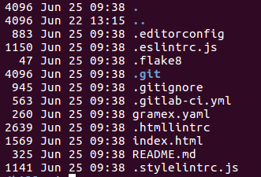
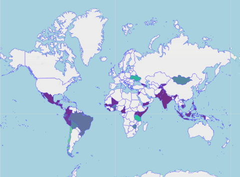

---
title: Quickstart Guide
prefix: Quickstart
...

[TOC]

## Introduction

This Quickstart guide is intended to familiarize first time users with the Gramex Platform.
The Quickstart guide follows a concise step based approach of creation a Visual story board from raw data.

The Quickstart guide focuses on the most common features, often accompanying such features with easy-to-understand code examples.
Complete code examples for any of the sections can be found under appropriate directories in this [repository](https://code.gramener.com/cto/quickstart/).

Alternatively, each section can be copy pasted into appropriate files and viewed by running gramex.

## Business Case

[Kiva](https://www.kiva.org/) is an international non-profit with a mission to connect people through lending to alleviate poverty.
The business case used in this Quickstart guide has been adapted from Kaggle Competition,Data Science for Good.
More details [here](https://www.kaggle.com/kiva/data-science-for-good-kiva-crowdfunding).

The dataset provided has the following features

- Loan Information - Loan ID, Loan Theme ID, Loan amounts, Loan term, Region, Use
- Region information - Region, Country, Currency, MPI, Lat, Lon

## Installing Gramex

- Install [Anaconda](https://www.anaconda.com/download/) 5.1 or higher on the machine
- Install [node.js](https://nodejs.org/en/) 8 or later. Then run `npm install -g yarn`.
This step is required for UI components and built-in apps.
- `PATH setup` Anaconda by default asks to add PATH in environment variables.


- On Windows, While installing `nodejs`, be sure to keep track of the directory in which its installed;
typically `C:/Program Files/nodejs/node` and ensure to add it to the system path. 


- If you are using MAC install [Xcode](https://idmsa.apple.com/IDMSWebAuth/login?appIdKey=891bd3417a7776362562d2197f89480a8547b108fd934911bcbea0110d07f757&path=%2Fdownload%2F&rv=1)

### Gramex Installation on Windows/Linux

- After satisfying  the above requirements in `Before you start` start installing gramex on your local machine.
- `Step 1`: Open Command prompt (or) Terminal
- `Step 2`: Run `pip install --verbose gramex`. Replace `gramex` with `gramex==1.32` for version 1.32 or later version.

```console
(gramexnew) λ pip install --verbose gramex
Config variable 'Py_DEBUG' is unset, Python ABI tag may be incorrect
Config variable 'WITH_PYMALLOC' is unset, Python ABI tag may be incorrect
Collecting gramex
  1 location(s) to search for versions of gramex:
  * https://pypi.python.org/simple/gramex/
  Getting page https://pypi.python.org/simple/gramex/
  Looking up "https://pypi.python.org/simple/gramex/" in the cache
  Current age based on date: 14
  Freshness lifetime from max-age: 600
  Freshness lifetime from request max-age: 600
  The response is "fresh", returning cached response
  600 > 14
  Analyzing links from page https://pypi.python.org/simple/gramex/
    Found link https://pypi.python.org/packages/a9/61/8051be1a0f3ab356a96ffcc6899059ef8ad7cb7413991d40333c8382260f/gramex-1.30.0.2.tar.gz#md5=975ff8c2f8e560d8a975bd9b1873eb45 (from https://pypi.python.org/simple/gramex/), version: 1.30.0.2
    Found link https://pypi.python.org/packages/93/b0/9229e85eca4a4475eeef60bcfc5f13711a932bebb79f98097f826a24e466/gramex-1.31.0.tar.gz#md5=2ed24830d3f552045e660be8f1f6f680 (from https://pypi.python.org/simple/gramex/), version: 1.31.0
    Found link https://pypi.python.org/packages/cb/e2/d658d69fb27f99457420dbfcbdd7aceb370a3c30f738f44636fe2cfa68d9/gramex-1.32.0.tar.gz#md5=378b8e4f030f0da25e5771f447dd042e (from https://pypi.python.org/simple/gramex/), version: 1.32.0
  Using version 1.32.0 (newest of versions: 1.30.0.2, 1.31.0, 1.32.0)
```

- `Step 3`: After successful installation Run `gramex` on command prompt (or) Terminal
- Log of actual request triggered along with underlying or supporting requests are displayed in the console.

```console
D:\tmp
(gramex) λ gramex
INFO    15-Apr 13:40:32 install Gramex 1.32.0 | guide --browser=/welcome | d:\anaconda\envs\gramex\lib\site-packages\gramex\apps\guide | Python 2.7.14 |Intel Corporation| (default, Feb 12 2018, 00:38:32) [MSC v.1500 64 bit (AMD64)]
WARNING 15-Apr 13:40:32 config Missing config: C:\Users\Gramener\AppData\Local\Gramex Data\mail\gramexmail.yaml
WARNING 15-Apr 13:40:33 watcher watch directory C:\Users\Gramener\AppData\Local\Gramex Data\mail does not exist
INFO    15-Apr 13:40:33 config No config found: C:\Users\Gramener\AppData\Local\Gramex Data\mail\gramexmail.yaml
INFO    15-Apr 13:40:34 __init__ Initialising schedule:gramex_update
INFO    15-Apr 13:40:34 __init__ Initialising schedule:create-user-database
INFO    15-Apr 13:40:37 __init__ Initialising schedule:data-setup-flags
INFO    15-Apr 13:40:37 dbsetup database.sqlite3 has flags table with data
INFO    15-Apr 13:40:37 __init__ Initialising schedule:data-setup-points
INFO    15-Apr 13:40:37 __init__ Initialising schedule:apps/logviewer-zxyfQ
INFO    15-Apr 13:40:38 __init__ Initialising schedule:run-on-startup
INFO    15-Apr 13:40:38 schedule:run-on-startup Scheduled msg (on startup)
INFO    15-Apr 13:40:38 __init__ Initialising schedule:run-every-hour
INFO    15-Apr 13:40:39 sqlitedict opening Sqlite table u'user' in C:\Users\Gramener\AppData\Local\Gramex Data\auth.user.db
INFO    15-Apr 13:40:39 capturehandler Pinging chromecapture.js at http://localhost:9900/
INFO    15-Apr 13:40:39 capturehandler Pinging chromecapture.js at http://localhost:9900/
INFO    15-Apr 13:40:40 __init__ Initialising alert: alert-email
WARNING 15-Apr 13:40:40 __init__ alert: alert-email: using first email service: alert-gmail
WARNING 15-Apr 13:40:40 scheduler schedule:alert-email has no schedule nor startup
INFO    15-Apr 13:40:40 __init__ Initialising alert: alert-html
WARNING 15-Apr 13:40:40 __init__ alert: alert-html: using first email service: alert-gmail
WARNING 15-Apr 13:40:40 scheduler schedule:alert-html has no schedule nor startup
INFO    15-Apr 13:40:40 __init__ Initialising alert: alert-markdown
WARNING 15-Apr 13:40:40 __init__ alert: alert-markdown: using first email service: alert-gmail
WARNING 15-Apr 13:40:40 scheduler schedule:alert-markdown has no schedule nor startup
INFO    15-Apr 13:40:40 __init__ Initialising alert: alert-content-file
WARNING 15-Apr 13:40:40 __init__ alert: alert-content-file: using first email service: alert-gmail
WARNING 15-Apr 13:40:40 scheduler schedule:alert-content-file has no schedule nor startup
INFO    15-Apr 13:40:40 __init__ Initialising alert: alert-images
WARNING 15-Apr 13:40:40 __init__ alert: alert-images: using first email service: alert-gmail
WARNING 15-Apr 13:40:40 scheduler schedule:alert-images has no schedule nor startup
INFO    15-Apr 13:40:40 __init__ Initialising alert: alert-attachments
WARNING 15-Apr 13:40:40 __init__ alert: alert-attachments: using first email service: alert-gmail
WARNING 15-Apr 13:40:40 scheduler schedule:alert-attachments has no schedule nor startup
INFO    15-Apr 13:40:40 __init__ Initialising alert: alert-templates
WARNING 15-Apr 13:40:40 __init__ alert: alert-templates: using first email service: alert-gmail
WARNING 15-Apr 13:40:40 scheduler schedule:alert-templates has no schedule nor startup
INFO    15-Apr 13:40:40 config No config found: C:\Users\Gramener\AppData\Local\Gramex Data\mail\gramexmail.yaml
INFO    15-Apr 13:40:40 __init__ Listening on port 9988
INFO    15-Apr 13:40:40 __init__ Opening http://127.0.0.1:9988/welcome in WindowsDefault browser
INFO    15-Apr 13:40:41 __init__ 304 GET /welcome (127.0.0.1) 16.00ms welcome
INFO    15-Apr 13:40:41 capturehandler Starting chromecapture.js via node "d:\anaconda\envs\gramex\lib\site-packages\gramex\apps\capture\chromecapture.js" --port=9900
INFO    15-Apr 13:40:41 capturehandler Starting chromecapture.js via node "d:\anaconda\envs\gramex\lib\site-packages\gramex\apps\capture\chromecapture.js" --port=9900
INFO    15-Apr 13:40:41 __init__ 304 GET /background.jpg (127.0.0.1) 4.00ms markdown
WARNING 15-Apr 13:40:42 __init__ 404 GET /favicon.ico (127.0.0.1) 40.00ms markdown
INFO    15-Apr 13:40:42 capturehandler Pinging chromecapture.js at http://localhost:9900/
INFO    15-Apr 13:40:42 capturehandler node.js: v8.9.4 chromecapture.js: 1.1.0 port: 9900 pid: 3884 live (pid=3884)
```

- `Step 4`: You will see a blue screen with text `Welcome to Gramex` as output.
Now you have gramex installed on your local machine.


- `Step 5`: In case you get 404 errors for `localhost:9988/welcome` or the page doesn't render properly,
run `gramex setup --all` to ensure all the nodejs modules are installed.

## Folder Structure of a Simple Gramex Dashboard

### Gramex Init

- `Step 1` Create a new folder with `project_name` on your local machine.
- `Step 2` Run `gramex init` on your preferred terminal (command prompt/cmder/terminal/GitBash etc.)
- It is the initial stage of your Data Visualization project.
`gramex init` will setup the necessary project linting files and default files.

List of files generated are below.

- [`.editorconfig`](#editorconfig)
- [`.eslintrc.js`](#eslintrcjs)
- [`.flake8`](#flake8)
- [`.gitlab-ci.yml`](#gitlab-ciyml)
- [`.gitignore`](#gitignore)



In addition, it generates a simple boilerplate for

- [`gramex.yaml`](#gramexyaml)
- [`index.html`](#indexhtml)
- [`readme.md`](#readmemd)

### .editorconfig

It helps developers define and maintain consistent coding styles between different editors and IDEs.
The EditorConfig project consists of a file format for defining coding styles and a collection of
text editor plugins that enable editors to read the file format and adhere to defined styles.
EditorConfig files are easily readable and they work nicely with version control systems. 

The supported Properties for `.editorconfig` are:

- Indent style.
- Indent size.
- End of line.
- Trim trailing whitespace.
- Insert final newline.

### .eslintrc.js
It is completely configurable for javascript, meaning you can turn off every rule and run only with
basic syntax validation, or mix and match the bundled rules and your custom rules which makes your project perfect.

There are several pieces of information that can be configured:

- `Environments` which environments your script is designed to run in. Each environment brings with it a certain set of predefined global variables.
- `Globals` the additional global variables your script accesses during execution.
- `Rules` which rules are enabled and at what error level.

### .flake8
- We can declare the parameters to lint Python code in the application.
- This helps in prevent things like syntax errors, typos, bad formatting, incorrect styling etc.,

### .gitlab-ci.yml
- All the projects build on top of gramex are deployed in to gitlab.
- This `.gitlab-ci.yml` uses a [`YAML`](http://yaml.org/spec/1.2/spec.html) file for project configuration.

### .gitignore
- This helps the gramex user to ignore files that should not be committed.
- specify the files that you would like to ignore.
- `example` file containing  Passwords, Private information.

### .htmllintrc
- In `htmllintrc` the user can define certain parameters so that It statically checks your documents for common errors in HTML code.

### gramex.yaml
- Gramex’s behaviour is controlled by a [`YAML`](http://yaml.org/spec/1.2/spec.html) file called gramex.yaml
- `gramex init` creates a `gramex.yaml` file which contains the below code as default

```yaml
import:
  ui:
    path: $GRAMEXAPPS/ui/gramex.yaml    # Import the UI components
    YAMLURL: $YAMLURL/ui/               # ... at this URL
```

### index.html
- The code related to `html` will be written here.
- styling must be defined in bootstrap classes.

### README.md
- User can document the project workflow in this `markdown` file

## Configuration and Handlers

Gramex is primarily configuration driven, and supports server configuration via YAML files.

Through a YAML file, developers define handlers, which trigger actions on receiving requests to the
server at developer defined endpoints.
Handlers can be used to manipulate data and render files, draw charts/visualizations,
allow for server side caching, configure the gramex web server, etc.

The `gramex.yaml` file serves as a base for all server configurations in a gramex app or dashboard.

For example:

```yaml
import:
  ui:
    path: $GRAMEXAPPS/ui/gramex.yaml    # Import the UI components
    YAMLURL: $YAMLURL/ui/               # ... at this URL
url:
  quickstart/home:                      # name of the endpoint
    pattern: /$YAMLURL/                 # The path/URL at which the request should be sent.
    handler: FileHandler                # The type of custom handler used
    kwargs:                             # Additional Parameters
      path: $YAMLPATH/index.html        # Which file to return.
```

This yaml configuration defines a single FileHandler endpoint.

FileHandler is used to render files or templates to the end user. In this case, on receiving a request to the homepage,
gramex will return index.html.

`$YAMLURL` and `$YAMLPATH` are environment variables which store the url and path of the current yaml file respectively.

For the purpose of this tutorial, 2 endpoints are defined, a FileHandler to serve the `index.html` file and a FormHandler to load and manipulate the data.

Thus the formhandler can be added to our current configuration as follows

The import key is used to import other gramex apps/yaml files.
In this case, it's being used to import the uicomponents library that is a key part of the styling in gramex apps. 

```yaml
url:
  quickstart/home:
    pattern: /$YAMLURL/
    handler: FileHandler
    kwargs:
      path: $YAMLPATH/index.html

  quickstart/formhandler:
    pattern: /$YAMLURL/data
    handler: FormHandler
    kwargs:
      url: $YAMLPATH/kiva_loans.csv
```

On receiving a request to the `/data` endpoint, Gramex, reads data from the CSV file and returns in
one of a few formats back to the front end.
By default, data is returned as a JSON, however it can also be returned as a simple html table,
an interactive table, a downloadable csv etc.

The import section of this yaml file allows developers to import configuration files from any other gramex project or app and mount them at a particular url. In this case, import is being used to mount the UI Components Library (to serve bootstrap and some JS Libraries)as well as an interactive table that can be viewed by visiting visiting [this link](http://localhost:9988/data?_format=table) with gramex running. 


Click [here](../config/) for more information about yaml configurations
and [here](../formhandler/) for more information about FormHandler.

Click [here](https://code.gramener.com/karmanya.aggarwal/quickstart/) to download a working example of the app.

Click [here](../) to see a list of all the custom handlers that gramex offers

## Scaffolding

The next step is to create a scaffolding of the dashboard, typically with inputs from the design team and front end engineers.
The scaffolding is intended to display the rough structure of the webpage before charts and tables are added.

This is done simply in HTML and bootstrap, using as little custom css as possible.
Often templates are used to reduce the amount of front end code required - the G1 library (a JS library developed in-house)
provides support for lodash templates, though gramex also supports Tornado Templates.

The UI component exposes a set of commonly used libraries (bootstrap, jquery, d3 etc) which allows
for developers to include these libraries without using a CDN, yarn/npm/bower etc.
Using it, requires importing the UI Components app using the import section of `gramex.yaml`

```yaml
import:
  ui:
    path: $GRAMEXAPPS/ui/gramex.yaml    # Import the UI components
    YAMLURL: $YAMLURL/ui/               # ... at this URL
```

After which, libraries can be included as follows

```html
<link rel="stylesheet" href="ui/bootstraptheme.css">
<script src="ui/jquery/dist/jquery.min.js"></script>
<script src="ui/popper.js/dist/umd/popper.min.js"></script>
<script src="ui/bootstrap/dist/js/bootstrap.min.js"></script>
```

This tutorial in particular doesn't have much in the way of a scaffolding, however,
the simple layout can be seen by exploring `index.html`

Click [here](../uicomponents/#libraries) for a list of all libraries included in UI Components

Click [here](https://code.gramener.com/cto/g1/blob/master/README.md) to see documentation for G1

## Charting

Once the scaffolding has been created, the data and scaffolding can be quickly validated via [formhandler tables](../formhandler/#formhandler-tables)
or a configuration driven [charting library](../formhandler/#formhandler-charts) (Vega, Vega-lite, Seaborn and Vegam).

For the purpose of this quickstart, we'll be using vega/vega-lite and vegam charts.
For this, we add a few more endpoints to the `gramex.yaml` file and specify the configurations for the charts that we've chosen. 

Vega/Vega-lite/Vegam all work well with the default json output orientation that FormHandler offers,
which makes adding charts almost seamless.

```yaml
url:
  data-u1:
    pattern: /$YAMLURL/data-u1
    handler: FormHandler
    kwargs:
      url: $YAMLPATH/data/kiva_loans.csv
      default:
        _limit: 1000
      function: data.dropna()
      modify: data.groupby(['region', 'country']).mean().reset_index()
      formats:
        barchart:        # Create a format named barchart
          format: vegam  # use Vegam for a charting library.
          spec:          # configuration for the vegam chart
            fromjson:
              - {data: __DATA__} # Get the data returned by the formhandler
              # Bar chart
              - {apply: bar, x: region, y: loan_amount, color: country, order: loan_amount}
              # Apply styles
              - {apply: style, x_sort_op: sum, x_sort_field: loan_amount, x_sort_order: descending}
      headers:
        Content-Type: application/javascript
    cache:
      expiry: {duration: 3600}
```

Here a new endpoint is added to our `gramex.yaml` named  `data-u1`, `data-u1` uses a FormHandler to
load the first 1000 rows of data, drop the nulls, group by region and country and return it as a json string.

It also defines a new custom format called barchart which is essentially a vegam chart that plots 
`region vs loan_amount` from our data and colors the bars by country.
Now, the charts can be inserted in any html page/template via a simple `<script>` tag

```html
<div>
  <script src="data-u1?_format=barchart"></script>
</div>
```

Thus, the script will make a request to the `alldata` endpoint, passing a start date, end date and
chart type to server via URL Parameters which can be accessed in the backend through the
request handler as in `somefunction(data,handler)`. 

`_format=barchart` tells gramex that the output needs to be rendered as the format named barchart,
via the spec defined in the yaml.

Finally, in order to use vega charts, an appropriate js file needs to be included.

```html
<script src="https://cdn.jsdelivr.net/npm/vega@3.2.1/build/vega.min.js"></script>
<script src="https://cdn.jsdelivr.net/npm/vega-lite@2.3.1/build/vega-lite.min.js"></script>
<script src="https://cdn.jsdelivr.net/npm/vegam@0.0.2/dist/vegam.min.js"></script>
```


For the formhandler table, 
The G1 Library needs to be included (preferably, under the body tag in the html), a div needs to be
included to contain the table and the table is rendered by calling the formhandler() function on that div. 

```html
<html>
  <body>
    <div class="formhandler" data-src="data"></div>
    <!-- first the element is inserted in place -->
  </body>
  <script src="ui/jquery/dist/jquery.min.js"></script>
  <script type="text/javascript" src="ui/g1/dist/g1.min.js"></script>
  <script>
  // then the table is rendered
  $('.formhandler').formhandler()
</script>
```

Additional parameters can be passed to the formhandler function - see a list in the [API documentation](https://code.gramener.com/cto/g1/#formhandler)

Some backend modifications are also required to ensure that the data returned from Formhandler is in
the format that each of the charts/tables expect.

## Backend Data Transformation
All the data visualization projects use python and its stack to filter data in the backend.

YAML files support python/pandas functions intended to transform the data  looking at the configuration we've defined

```yaml
url:
  data-u1:
    pattern: /$YAMLURL/data-u1
    handler: FormHandler
    kwargs:
      url: $YAMLPATH/data/kiva_loans.csv
      default:
        _limit: 1000
      function: data.dropna() # loaded data is accessed through a dataframe `data`
                              # dropna() is a pandas function that drops null rows
      modify: data.groupby(['region', 'country']).mean().reset_index()
      # modify again is called on the dataframe. 
```

it's also possible to reference functions inside python files as referenced below - 

```yaml
url:
  data-u1:
    pattern: /$YAMLURL/data-u1
    handler: FormHandler
    kwargs:
      url: $YAMLPATH/data/kiva_loans.csv
      default:
        _limit: 1000
      function: somefile.somefunc(data) # somefile.py contains `somefunc` function
      modify: data.groupby(['region', 'country']).mean().reset_index()
```

and `somefile` contains

```python
def somefunc(data): #functions should return a dataframe.
  return data.dropna()
```

by default formhandler returns data as a json with the following structure

```json
[{"col 1":"a","col 2":"b"}, {"col 1":"c","col 2":"d"}]
```

for more features of formhandler, and the difference between function and modify click [here](../formhandler/)

## Interactivity/Drilldowns and Filtering

In order to facilitate filtering and drilldowns, the G1 library provides a urlfilter function which
updates url parameters in place - combined with formhandler, this allows for complicated filterign
with very little custom code written.

To use url filter, you first tag elements in html with the urlfilter class, then call urlfilter on the containing div. 

for example,

```html
<button id="et" class="btn btn-secondary btn-danger urlfilter"
  href="?city=somevalue" data-target="pushState">
  Errors and Tracebacks
</button>
<script>
  $('body').urlfilter() //calls urlfilter on all elements in the body tag
</script>
```

On clicking the referenced button, the page's url will be updated to include `city=somevalue`,
which can then be picked up by multiple components on the same page. 

Thus, can be used to very easily filter views and data across multiple components
From the quickstart example, look at the following function from fdd.js 

```js
function vega_update() {
  var url = g1.url.parse(location.hash.substr(1))
  $('svg.marks').each(function(){_vegaUpdate(this, url)})
}
```

here, `url.parse` is used to pick up filter information from the url and pass it to the vega charts
in order to update multiple charts at the same time. 

Vega/Vegam/Vega-lite support limited interaction - tooltips and basic brushing is supported, however,
for highly customized charts or svg interaction, d3.js can be used.

While Gramener has some d3 charts already built and componentized, very often these are required to 
be custom built for a usecase or project.
In order to do that, the UI Components library includes d3.js so it can be included in the html and used as follows

```html
<script src='ui/d3/build/d3.min.js'></script>
<!-- load data from the endpoint using AJAX calls and pass it to various charts -->
<script>
$.getJSON('data', function(data){
  chart(data)  // Chart is the function that draws the d3.js chart.
})
</script>
```

d3 is a large library and is outside the scope of this guide. 

## Screenshots via CaptureHandler

Gramex has a feature to export your visuals in the following formats

- `PDF`
- `PNG`
- `PPTX`
- `JPG`

Follow the steps below to capture the dashboard

- Configure the YAML file as follows - 

```yaml
url:
  capture:
    pattern: /$YAMLURL/capture
    handler: CaptureHandler
    kwargs:
      engine: chrome  # The engine used to capture the visual
      port: 9901      # The port on which capturehandler will run
      timeout: 20     # The time for which the server response is awaited
```

Post this, navigating to the capture endpoint will cause the server to take the capture and return the appropriate format.
Preferred output format, delay, orientation and url to capture can be passed via url query parameters 

```html
<ul class="dropdown-menu dropdown-right">
  <li><a href="capture?ext=pdf?orientation=landscape?delay=1000">PDF screenshot</a></li>
  <li><a href="capture?ext=png?orientation=landscape?delay=1000">PNG screenshot</a></li>
  <li><a href="capture?ext=jpg?orientation=landscape?delay=1000">JPG screenshot</a></li>
  <li><a href="capture?ext=pptx?orientation=landscape?delay=1000">PPTX screenshot</a></li>
</ul>
```

From html, even if no url is passed, the referrer url will be the target.
However, if the capture is triggered from javascript url must be passed.

```js
  $('.screenshot').attr('href', 'capture' +
    '?url=' + encodeURIComponent(url) + '&header=' + encodeURIComponent(header))
```

for more information about capturehandler check out the [guide](../capturehandler/)

## Authentication

Gramex offers multiple methods to enforce access control and authentication.
The simplest of these, conveniently named `SimpleAuth` has user login details stored in the yaml file itself.
Obviously, this is primarily intended for testing purposes and **isn't recommend** for production/deployment scenarios.

This requires creating two new endpoints in our yaml

```yaml
url:
  simpleauth:
    pattern: /$YAMLURL/login  # Map this URL
    handler: SimpleAuth       # to the SimpleAuth handler
    kwargs:
      credentials:            # Specify the user IDs and passwords
        gamma:                # The user gamma is defined as a mapping
          password: pwd       # One of the keys MUST be "password"
          role: user          # Additional keys can be defined
        alpha: alpha          # This declares a user called alpha with password alpha
      template: $YAMLPATH/simple.html   # Optional login template
      redirect: /$YAMLURL/
  logout:
    pattern: /$YAMLURL/logout # Map this URL
    handler: LogoutHandler
    kwargs:
      redirect: /$YAMLURL/login
```

The addition of these two handlers will load a tornado template called `simple.html` (which contains a login form),
upon the user logging in, the redirect key will redirect the page to the homepage or `index.html` and
visiting the logout url will remove the logged in user's details fom the session and redirect back to the login page.

Note, the login handler in this snippet adds two users, the first, with user name 'gamma' and password 'pwd',
and the second with username 'alpha' and password 'alpha'

## G1 Mapviewer

The G1 library also includes a module that allows for easy map based visuals. 
in order to create the choropleth used in the example, the following modifications were required in the html. 

```html
<!-- stylesheets and js files need to be included, using ui components links-->
<link rel="stylesheet" href="ui/leaflet/dist/leaflet.css">
<script src="ui/leaflet/dist/leaflet.js"></script>
<script src="ui/d3/build/d3.js"></script>
<script src="node_modules/d3-scale-chromatic/dist/d3-scale-chromatic.js"></script>
<script src="ui/g1/dist/g1.min.js"></script>
<script src="ui/g1/dist/mapviewer.min.js"></script>
```

Post including the requisite files, a div needs to be created to contain the map - this div needs to have a definite height.

Finally, the configuration for the map needs to passed as a dictionary to the g1.mapviewer function

```html
<div id='geojson-map' style="height:600px">
<script>
  var map = g1.mapviewer({
    id: 'geojson-map',        // select the div to contain the map
    layers: {
      worldMap: {             // worldMap acts as our basemap layer
        type: 'tile',
        url: 'http://{s}.tile.openstreetmap.org/{z}/{x}/{y}.png'
      },
      indiaGeojson: {         // a geojson layer that draws polygons
        type: 'geojson',
        url: '/static/worldmapgeo.json',
        link: {
          url: '/data-u2',    // The formhandler endpoint,url to get data from
          dataKey: 'country', // Join this column from the URL (data)
          mapKey: 'NAME_EN'   // with this property in the GeoJSON
        },
        options:{             // default attributes for the geoJson layer
          style: {
            fillColor: '#eee',
            fillOpacity: 0.2,
            weight: 0.5
          }
        },
        attrs: {               // attributes for the merged properties
          fillColor: {         // Fill the regions
            metric: 'loan_amount',  // with the "score" column from state_score.json
            scheme: 'Viridis',
          },
          fillOpacity: 0.8,
          tooltip: function(prop) {
            // On hover, show this HTML tooltip
            return prop.country + ': ' + prop.loan_amount
          }
        }
      }
    }
  })
</script>
```

In this example, we have a geojson file, that contains polygons demarking countries in the world map.
Each polygon has associated labels, we're interested in the `NAME_EN` property which contains the name
of the country that the polygon represents in English.

Similarly, our dataset contains the columns `country` and `loan_amount` - thus this configuration 
performs a join on the data from our csv file based on `country` and `NAME_EN` and assigns colours
by the value of `loan_amount` on the map according to the colorscheme Viridis.

The output should look similar to this 
