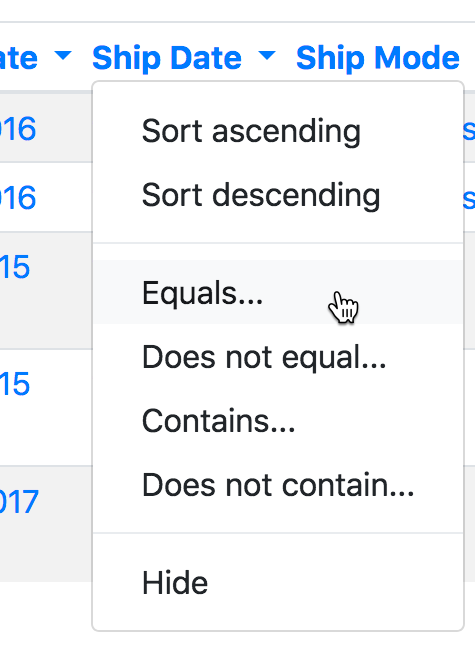
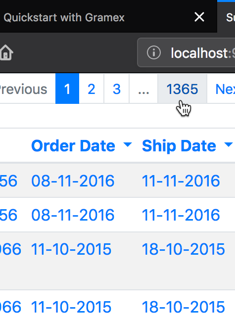

---
title: Quickstart with Gramex
prefix: Quickstart
...

[TOC]

Gramex is a platform that allows users to create visual storyboards from data. This guide follows a concise, step by step approach to create a simple dashboard that analyses and displays a fictional supermarket's sales;
grouped by product segment, region and product category.

## Introduction

SuperStore is a fictional department store for whom we will build a data application with Gramex.
This application will allow users to see the store's sales across segments at a glance. 
After finishing this tutorial, we will be able to:

1. Convert a data file into a REST API,
2. Preview the data in an interactive table,
3. Create a chart showing sales across multiple categories, and

This is what the data looks like:

<div class="formhandler" data-src="data?_c=-Order%20ID&_c=-Sub-Category&_c=-Sales&_c=-Quantity&_c=-Ship%20Mode&_c=-Ship%20Date"></div>
<script>
  $('.formhandler').formhandler({pageSize: 5})
</script>

Remember that our goal is to display the sales made by the store in concise manner. Thus, the fields relevant
to sales are:

* Sales - the value in USD of a particular order.
* Region, State and City - the place where the sale was made.
* Category, SubCategory - the type of the product that was sold.
* Segment - the type of customer who bought the product.

<p class="alert alert-success" role="alert">
<i class="fas fa-eye"></i> After completing this exercise, our application should look like <a href="index5.html">this</a>.
</p>

### Requirements

In order to start this tutorial, we will need to:

* [Install and set up Gramex](../install)
* [Download the data](serve/store-sales.csv) and save it at a convenient location on your computer.

<div class="card shadow text-white bg-dark">
  <div class="card-body">
  <p class="card-text">
    Any action items, points of interest, or places where you have to edit code will be displayed in a card similar to this one.
  </p>
  </div>
</div>

## Step 0: Create the Project
<details>
  <summary> Expand This Section </summary>

We need a place to hold together all the files related to our application - including data, source code and configuration files.

<div class="card shadow text-white bg-dark">
  <div class="card-body">
  <p class="card-text">
    Create a folder at a convenient location on your computer and move the downloaded dataset file into it.
  </p>
  </div>
</div>

<br>
For the remainder of the tutorial, we will refer to this folder as the "project folder". At this time, the project folder should only contain the file `store-sales.csv`.

<div class="card shadow text-white bg-dark">
  <div class="card-body">
    <div class="card-text">
    <ul>
      <li>To set up the project, create a file named <kbd>gramex.yaml</kbd> in the project folder, leave it blank for now.</li>
      <li>Create a second file called <kbd>index.html</kbd> and put any html you like in there. For now, just a simple bit of text will do.</li>
    </ul>
    </div>
  </div>
</div>
<br>

`"index.html"` and `"gramex.yaml"` are the only two files we'll be editing throughout this guide. For now, let's put some text in `"index.html"`:
<br>

<div class="card shadow text-white bg-dark">
  <div class="card-body">
  <div class="card-text">
    <p>Open up a terminal, navigate to the project folder and type the following:</p>
    <ul class="nav nav-tabs">
      <li class="nav-item">
        <a class="nav-link active"><i class="fas fa-terminal"></i> Terminal</a>
      </li>
    </ul>
    <pre><code id="bash1" class="bash"></code></pre>
  </div>
  </div>
</div>  
<br>

<script>
  $.get('snippets/hello.sh').done(
    (e) => { $('#bash1').text(e) }
  )
</script>

<div class="card shadow text-white bg-dark">
  <div class="card-body">
    <div class="card-text">
      <p>Type the following command to start the Gramex server.</p>
      <ul class="nav nav-tabs">
        <li class="nav-item">
          <a class="nav-link active"><i class="fas fa-terminal"></i> Terminal</a>
        </li>
      </ul>
      <pre><code id="bash2" class="bash">gramex</code></pre>
    </div>
  </div>
</div>  
<br>

We should start seeing some output now, which is the Gramex server logging its startup sequence. Once we see the following lines, Gramex has fully started, and is ready to accept requests.

```console
INFO    22-Apr 13:34:26 __init__ PORT Listening on port 9988
INFO    22-Apr 13:34:26 __init__ 9988 <Ctrl-B> opens the browser. <Ctrl-D> starts the debugger.
```

Note that these may not be the _last_ lines you see in the startup logs, since some Gramex services may start later. Look for these lines in the last few lines.

At this time, if you open a browser window at [`http://localhost:9988`](http://localhost:9988), you should see the text in `"index.html"`.

<p class="alert alert-success" role="alert">
<i class="fas fa-eye"></i> It should look something like <a href="index2.html">this</a>.
</p>

Gramex internally watches files for changes, so we can change anything in `"index.html"`, and refresh the link in the browser without restarting the server.

</details>

## Step 1: Expose the data through a REST API
<details>
  <summary> Expand This Section </summary>

In order to provide our dashboard with access to the data, we need to create a URL that sends data to the dashboard. To do this, we use a Gramex component called [`FormHandler`](../formhandler).

<div class="card shadow text-white bg-dark">
  <div class="card-body">
    <div class="card-text">
      <p>Create a formhandler endpoint on our server by adding the following lines to the empty <kbd>gramex.yaml</kbd> file, which we had created in the previous section:</p>
      <ul class="nav nav-tabs">
        <li class="nav-item">
          <a class="nav-link active"><i class="fas fa-code"></i> <span class="text-monospace">gramex.yaml</span></a>
        </li>
      </ul>
      <pre><code id="yaml1" class="language-yaml"></code></pre>
    </div>
  </div>
</div>

<script>
  $.get('snippets/gramex1.yaml').done(
    (e) => { $('#yaml1').text(e) }
  )
</script>


After you save the file, Gramex will be able to serve the CSV data through the `/data` resource endpoint. To verify this, visit [`http://localhost:9988/data?_limit=10`](http://localhost:9988/data?_limit=10) in your browser. You should now see a JSON payload representing the first ten rows of the dataset.

<p class="alert alert-success" role="alert">
<i class="fa fa-eye"></i> It should look like <a href="data?_limit=10">this</a>.
</p>

You could also, visit [http://localhost:9988/data?_limit=10&_format=html](http://localhost:9988/data?_limit=10&_format=html) to see the first ten rows as a simple HTML table.

<p class="alert alert-success" role="alert">
<i class="fa fa-eye"></i> It should look like <a href="data?_limit=10&_format=html">this</a>.
</p>

</details>

## Step 2: Laying out some scaffolding
<details>
  <summary> Expand This Section </summary>

Since we now have access to the data from a REST API, we are ready to start building the frontend.

<div class="card shadow text-white bg-dark">
  <div class="card-body">
    <div class="card-text">
      <p>At the moment, our <kbd>index.html</kbd> file just has some text in it. Let's add the following HTML to it.</p>
      <ul class="nav nav-tabs">
        <li class="nav-item">
          <a class="nav-link active"><i class="fas fa-code"></i> <span class="text-monospace">index.html</span></a>
        </li>
      </ul>
      <pre><code id="html1" class="language-html"></code></pre>
    </div>
  </div>
</div>

<script>
  $.get('snippets/index1.html').done(
    (e) => { $('#html1').text(e) }
  )
</script>

This is just some boilerplate that includes css and js files we will need.

Note that all of our css and js links are relative to a `ui/` directory - but we have no such directory in our project folder.

This is because Gramex bundles a lot of common css and js files ([bootstrap](https://getbootstrap.com), [lodash](https://lodash.com), [g1](https://www.npmjs.com/package/g1)) as part of a feature called [UI Components](../uicomponents). 

<div class="card shadow text-white bg-dark">
  <div class="card-body">
    <div class="card-text">
      <p>To use these in our dashboard, we add the following lines to our <kbd>gramex.yaml</kbd>:</p>
      <ul class="nav nav-tabs">
        <li class="nav-item">
          <a class="nav-link active"><i class="fas fa-code"></i> <span class="text-monospace">gramex.yaml</span></a>
        </li>
      </ul>
      <pre><code id="yaml2" class="language-yaml"></code></pre>
    </div>
  </div>
</div>

<script>
  $.get('snippets/gramex_2.yaml').done(
    (e) => { $('#yaml2').text(e) }
  )
</script>

<br>
At this point, `gramex.yaml` contains the following lines and will not change for the rest of this tutorial. Essentially, we are done with the backend configuration.

<ul class="nav nav-tabs">
  <li class="nav-item">
    <a class="nav-link active"><i class="fas fa-code"></i> <span class="text-monospace">gramex.yaml</span></a>
  </li>
</ul>
<pre><code id="yaml3" class="language-yaml"></code></pre>
<script>
  $.get('gramex2.yaml').done(
    (e) => { $('#yaml3').text(e) }
  )
</script>

<p class="alert alert-success" role="alert">
<i class="fa fa-eye"></i> At this time our HTML should look like <a href="index6.html">this</a>.
</p>
</details>

## Step 3: Filling in the Data
<details>
  <summary> Expand This Section </summary>
 
The simplest and sometimes most effective way to represent data can be a table. 
Accordingly, Gramex provides a way of embedding tabular data in any HTML page as an interactive table. 

<div class="card shadow text-white bg-dark">
  <div class="card-body">
    <div class="card-text">
      <p>To show the data as a table, insert the following lines in <kbd>index.html</kbd>:</p>
      <ul class="nav nav-tabs">
        <li class="nav-item">
          <a class="nav-link active"><i class="fas fa-code"></i> <span class="text-monospace">index.html</span></a>
        </li>
      </ul>
      <pre><code id="html2" class="language-html"></code></pre>
    </div>
  </div>
</div>

<script>
  $.get('snippets/fh.html').done(
    (e) => { $('#html2').text(e) }
  )
</script>

<br>
The full `index.html` file now looks like:
<ul class="nav nav-tabs">
  <li class="nav-item">
    <a class="nav-link active"><i class="fas fa-code"></i> <span class="text-monospace">index.html</span></a>
  </li>
</ul>
<pre><code id="html3" class="language-html"></code></pre>

<script>
  $.get('snippets/fh-after.html').done(
    (e) => { $('#html3').text(e) }
  )
</script>


After saving the file, when we open [`http://localhost:9988`](http://localhost:9988), we should see a table similar to the one at the top of this page. 

The table is interactive. Try playing around with it. Here's a few things you could try:

<div class="card-deck">
  <div class="card shadow text-white bg-dark">
    
    <div class="card-body">
      <p class="card-text">Click the dropdown arrows near the column headers to see column options.
    </div>
  </div>
  <div class="card shadow text-white bg-dark">
    
    <div class="card-body">
      <p class="card-text">Try getting the second, third or the 1365th 'page' of the dataset from the menu at the top of the table.
    </div>
  </div>
  <div class="card shadow text-white bg-dark">
    
    <div class="card-body">
      <p class="card-text">See 20, 50 or more rows at a time in the table from the dropdown menu to the right of the page list.
    </div>
  </div>
</div>

<br>
<p class="alert alert-success" role="alert">
<i class="fa fa-eye"></i> At this time our HTML should look like <a href="index7.html">this</a>.
</p>

</details>

## Step 4: Adding A Chart
<details>
  <summary> Expand This Section </summary>

Let's add a simple barchart to display data grouped by Segment. Formhandler automatically does the grouping for us simply by changing the URL. Adding a `?_by` query to any FormHandler URL, like [data?_by=Segment](data?_by=Segment), changes the output: each of our numeric columns now has the sum of all rows having a particular Segment value.

FormHandler lets us do a lot of data querying, filtering and grouping just by editing the URL. See [FormHandler Filters](../formhandler/#formhandler-filters) for  list of all possible values.

To actually draw the chart, we'll use a library called [Vega-lite](https://vega.github.io/vega-lite/). Vega-lite is a really simple to use, configuration driven javascript charting library and supports many common chart types. To draw a chart, we add a few pieces to our `index.html`.

<div class="card shadow text-white bg-dark">
  <div class="card-body">
    <div class="card-text">
      <p>Add the following <span class="font-italic">chart specification</span> to your HTML:</p>
      <ul class="nav nav-tabs">
        <li class="nav-item">
          <a class="nav-link active"><i class="fas fa-code"></i> <span class="text-monospace">index.html</span></a>
        </li>
      </ul>
      <pre><code id="html4" class="language-html"></code></pre>
    </div>
  </div>
</div>

<script>
  $.get('snippets/chartspec.html').done(
    (e) => { $('#html4').text(e) }
  )
</script>

Details of the specification can be found in the vega-lite [docs](https://vega.github.io/vega-lite/docs/), but some things to note:

* the spec consists of a bunch of nested fields, `width`, `height`, `data`, etc
* the data key is set to the FormHandler URL with grouping by Segment: `{"url": "data?_by=Segment"}`
* We've set the x and y axis values to `Sales|sum` and `Segment` respectively, telling Vega-lite to plot those quantities from the data that FormHandler returns. 

<div class="card shadow text-white bg-dark">
  <div class="card-body">
    <div class="card-text">
      <p>Add a div in the page in which to place the chart, and a little bit of Javascript code to render the chart:</p>
      <ul class="nav nav-tabs">
        <li class="nav-item">
          <a class="nav-link active"><i class="fas fa-code"></i> <span class="text-monospace">index.html</span></a>
        </li>
      </ul>
      <pre><code id="html5" class="language-html"></code></pre>
    </div>
  </div>
</div>

<script>
  $.get('snippets/vega1.html').done(
    (e) => { $('#html5').text(e) }
  )
</script>

<br>

At this stage, the contents of `index.html` should be as follows:
<ul class="nav nav-tabs">
  <li class="nav-item">
    <a class="nav-link active"><i class="fas fa-code"></i> <span class="text-monospace">index.html</span></a>
  </li>
</ul>
<pre><code id="html6" class="language-html"></code></pre>

<script>
  $.get('index4.html').done(
    (e) => { $('#html6').text(e) }
  )
</script>

<p class="alert alert-success" role="alert">
<i class="fa fa-eye"></i> At this time our HTML should look like <a href="index4.html">this</a>.
</p>

</details>

## Step 5: Appearance and Final Touches
<details>
  <summary> Expand This Section </summary>

We can now flex front-end muscle to make our dashboard look slightly better. We will keep this section short, but frontend appearances can be endlessly configured. Feel free to go through the rest of our guides to get a better handle on some of these. 

Let's add a second chart to plot the aggregate sum of Quantity by Segment. It's the same chart - we are just changing the axes. Thus, we can reuse the earlier specification, but we still need to change values of certain fields. So we created a function to which we can pass the fields that need to be updated: the div to draw the chart, the x-axis column name and the title of the chart.

<div class="card shadow text-white bg-dark">
  <div class="card-body">
    <div class="card-text">
      <p>Create a function which accepts the fields to be updated, the <code>&lt;div&gt;</code> to place the chart, the X-axis label and the title of the chart.</p>
      <ul class="nav nav-tabs">
        <li class="nav-item">
          <a class="nav-link active"><i class="fas fa-code"></i> <span class="text-monospace">index.html</span></a>
        </li>
      </ul>
      <pre><code id="js1" class="language-javascript"></code></pre>
    </div>
  </div>
</div>

<script>
  $.get('snippets/render.js', (e) => { $('#js1').text(e) }, 'text')
</script>

<br>

Here are a few more ways in which we can tweak our dashboard:

1. To hide some of the columns from our dataset, we can use a FormHandler filter similar to what we had introduced in Step 4.
2. We can use a feature of UI components, which allows us to override [bootstrap variables by passing url query parameters to the css import line](../uicomponents/#custom-bootstrap). For example, setting link-color to black.
3. We can modify the vega-lite configuration of the chart to add a color scale, and change the fonts of the chart. 

<p class="alert alert-success" role="alert">
<i class="fa fa-eye"></i> To see all of this configuration in action, see <a href="index5.html">this</a>.
</p>
<p class="alert alert-success" role="alert">
<i class="fa fa-download"></i> Download the final <a href="serve/gramex2.yaml">gramex.yaml</a>.
</p>

</details>

## Next steps

If you have followed along with this quickstart, you now have a basic idea of how to build a simple static dashboard with Gramex.
To see more of what Gramex's functionality and features; look at:

* our [demos](gramener.com/demo),
* the rest of our [tutorials](../tutorials), and
* our detailed [documentation](../).


## Troubleshooting

- Gramex doesn't start:
    - [Inotify watch limit reached](https://unix.stackexchange.com/questions/s just13751/kernel-inotify-watch-limit-reached)
    - Port is busy
        - Gramex runs on port 9988 by default, you can run `gramex --listen.port=<port number>` to run on an arbritary port. 
- Don't see any text at localhost:9988, instead just a list of files in the directory
    - You may not have a gramex.yaml in your project directory. Create one and restart Gramex.
- CSS/JS Not available.
    - You may have forgotten to add UI Components in Step 2, or could be missing NodeJS; ensure NodeJS is installed, run `gramex setup ui` and restart gramex. If it still doesn't work, open an issue on [github](https://github.com/gramener/gramex) or email cto@gramener.com  
- vega chart not rendering for some reason
    - You may have forgotten to include vega and vega lite dependencies in step 2.
