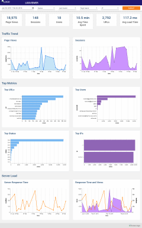
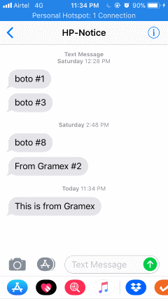

---
title: Gramex 1.30 Release Notes
prefix: 1.30
...

[TOC]

## Log viewer

Gramex features a built-in [log viewer](../../logviewer/log/) application.
This is a mini-application that is embedded with Gramex.

[](../../logviewer/log/)

This currently shows the

- traffic trend
- session trend
- top pages
- top users
- server response time
- etc

Users can *select any period* over which to view this data, and filter for
specific users, statuses, etc.

Deploying the application just required adding this configuration:

```yaml
import:
  logviewer:
    path: $GRAMEXAPPS/logviewer/gramex.yaml   # Source of the app
    YAMLURL: $YAMLURL/log/                    # Location to mount at
    namespace: [url, schedule]                # Avoid name space conflicts
    auth: ...                                 # Restrict access as required
```


## Proxy APIs

[ProxyHandler](../../proxyhandler/), which was introduced in [v1.29][v1.29] that
lets you access REST APIs from the browser. We can connect to most web
applications:

- *Enterprise apps*: SalesForce, SAP, JIRA, Trello, Github, etc
- *Social apps*: LinkedIn, Google, Facebook, Twitter, etc

This has 2 advantages:

1. **Access data live**. We treat the apps like live databases and query them directly.
2. Build **client-side applications** easily. This avoids the need to write
   Python code -- which may be complicated by the need to log in.

For example, a simple configuration exposes the Google Translation API to Gramex apps:

[Translate "How are you" to Hindi](../../proxyhandler/googletranslate?q=How+are+you&target=hi)

## OAuth2 login

ProxyHandler is more powerful with the [OAuth2](../../auth/#oauth2) handler -
which is new in v1.30. This lets users log into all the above applications, and
allows ProxyHandler to access *the logged in user's data*.

This also lets us build secure applications where Gramex does not store data,
but shows users their own data, like:

- [Google data](../../proxyhandler/#google-proxyhandler), such as GMail, Drive files, Calendar events, Contacts, etc
- [Facebook data](../../proxyhandler/#facebook-proxyhandler), such as profile, feed, friends & photos.

## Multiple logins

Users can now into multiple auth engines at the same time. For example, you can
log in with *both* [DBAuth](../../auth/#database-auth) *and*
[LDAP](../../auth/#ldap-auth). This lets you link users' DBAuth login to an
LDAP login ID dynamically.

This is enabled by [user attributes](../../auth/#user-attributes). All auth
handlers let you define which session key to store the user attributes in.

This defaults to `user`. But you can set it to `ldap` for the LDAP auth handler,
and have `handler.session.user` hold the DBAuth info, and `handler.session.ldap`
hold the LDAP info.

If you want to save this information somewhere, or perform any post-login
action, the best place to do that is [login actions](../../auth/#login-actions).

## SMS notification

Gramex is now integrated with [Amazon's SNS](https://aws.amazon.com/sns/).
This lets us [send an SMS message](../../sms/) at fairly
[low rates](https://aws.amazon.com/sns/sms-pricing/).

You can [test it out here](../../sms/#send-sms).

The code to do this is simple too. Once configured, just run:

```python
notifier.send(
    to='+919741552552',
    subject='This is from Gramex',
)
```

Here is the output:



This lets you send mobile alerts if there's any **unusual business scenario**, like:

- Large order *entered* in the system
- Device, server or service is *down*
- Highly suitable candidate has *applied* for a job
- Unusual *increase* in website traffic

You can also send mobile alerts as summaries. For example:

- Daily highlights
- Top trade movements of the hour
- Most active salespeople of the week

This also paves the way for more features, like:

- Two-factor authentication (login via mobile)
- Chatbots via mobile

## Config reload

Earlier, if `gramex.yaml` changed, Gramex would reload the entire application.
Re-launching ChromeCapture, PhantomJS, and every single one of your handlers,
schedulers, etc.

Now Gramex is faster. It reloads a handler or scheduler *only if* its
configuration has changed.

Gramex can also be [dynamically reconfigured](../../config/#dynamic-configuration).
-- creating new URLs on the fly. This can be used to:

- Generate SQL queries on the fly and mount FormHandlers
- Generate multiple URLs, one for each table on a Database

**NOTE**: Since these URLs are constructed dynamically, it makes the application
more complex that it is worth. *Use with caution.*

## Documentation

The [Guide](../../) now features a [Search](../../search/) feature with
full-text search. This is handy if you want to understand:

- [Where transform is used](../../search/#transform)
- [How XSRF works](../../search/#how xsrf works)
- [Various ways of creating charts](../../search/#charts)
- etc.

The [deployment guide](../../deploy/) has a new section on [shared
deployment](../..//deploy/#shared-deployment) that lists common problems when
deploying multiple applications to the same instance - like on
[uat.gramener.com](https://uat.gramener.com/monitor/apps). The biggest problem
is that the app runs locally, but not on the server. And it's simple to fix.

## Others

- [Bootstrap select](https://github.com/silviomoreto/bootstrap-select/)
  is now part of the [UI Component library](../../uicomponents/)
- `gramex.cache.open(path, 'bin')` returns the path contents in binary mode

## Bugs

- [FileHandler](../../filehandler/) now lets you scroll index pages
- [ProxyHandler](../../proxyhandler/) fixes incorrect Content-Length headers
- [Command-line alerts](../../alerts/#alert-command-line) do not throw an import error
- Malformed `gramex.yaml` files are treated as empty files, and no longer stop the re-configuration
- URL handler key names are converted to string (not unicode) for Python 2.7 compatibility
- Sometimes, HDF5 session files do not start, and session `.change` was not initiated. Fixed

## Stats

- Code base: 23,896 lines (python: 14,744, javascript: 1,148, tests: 8,004)
  (*Note*: We used to report without JavaScript until last version.)
- Test coverage: 79%

## Upgrade

To upgrade Gramex, run:

```bash
pip uninstall gramex
pip install --verbose https://github.com/gramener/gramex/archive/master.zip
```

This downloads Chromium and other front-end dependencies. That may take time.

[v1.29]: https://learn.gramener.com/gramex/history#v1-29-0-2018-02-15
