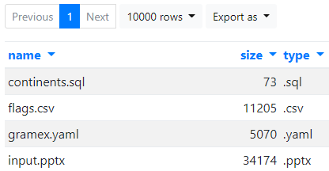
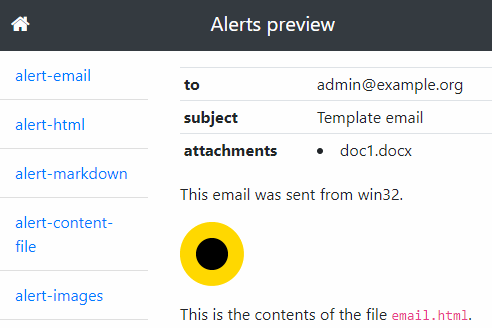
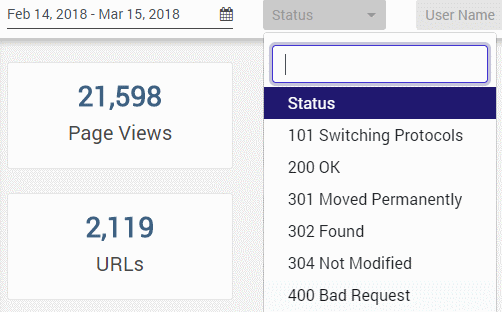
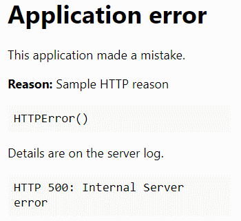
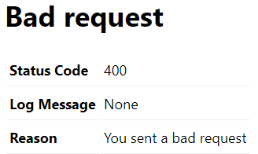

---
title: Gramex 1.31 Release Notes
prefix: 1.31
...

[TOC]

## Installation

Gramex is now on [PyPi](https://pypi.python.org/pypi/gramex). Installing is much
easier. Just run:

```bash
pip install --verbose gramex
```

## API integration

The Guide features more demos of how to use external APIs.

1. [Speech query application](../../speech/) shows the most relevant dashboard
   when you ask it a question. By
   [@santhosh.j](https://code.grameneer.com/santhosh.j) and
   [@athibanraj.t](https://code.gramener.com/athibanraj.t).
2. [Google Cloud NLP API](../../proxyhandler/#google-cloud-nlp) helps analyze
   entities in text and to estimate the sentiment.
3. [Google Search API](../../proxyhandler/#google-search) retrieves a few
   search results at a time.

[](../../speech/)

## Charts

[FormHandler supports Vega charts](../../formhandler/#formhandler-vega-charts).
You can use the full power of Vega and Vega-Lite charts with just configuration.
Here's an example:

<script src="../../formhandler/vega-1?_format=barchart"></script>
<script src="https://cdn.jsdelivr.net/npm/vega@3.2.1/build/vega.min.js"></script>

```
<script src="../../formhandler/vega?_format=barchart"></script>
<script src="https://cdn.jsdelivr.net/npm/vega@3.2.1/build/vega.min.js"></script>
```

## FormHandler directory browsing

FormHandler can go beyond files and databases. Our plan it to integrate with
Spark, cloud APIs and other sources. For now, you can browse files in
directories, converting FormHandler into a simple file explorer.

[](../../formhandler/dir?_format=table&_c=name&_c=size&_c=type)

## Alert preview

[Alerts now support previews](../../alert/preview/). You can see what alert
emails look like before sending them out. We plan to improve this app into a
full-fledged mailing and scheduling application.

[](../../alert/preview/)

**Note:** Until Gramex 1.30, emails without a schedule were sent on startup.
Now, emails are sent only if they have an explicit schedule, or are triggered
manually.

## Log viewer

[Log viewer](../../logviewer/log/) ignores static content (like images, JS/CSS
scripts, etc), and displays more friendly HTTP statuses.



## Developer updates

### Prevent URL conflicts

When 2 URLs from different applications have the same key, only one of them
work. You can use [YAML wildcard keys](../../config#yaml-wildcard-keys) which
generate random key names to prevent this.

```yaml
url:
    my-app-$*:                  # The '$*' is replaced by a random value
        pattern: ...
```

Also, if the developer specifies an invalid URL regular expression, like
`/dir/*`, Gramex mentions this as an error and continues. (It used to stop
processing all configurations earlier.)

### Path arguments

When you have a URL pattern with regular expression wild cards like this:

```yaml
url:
    path:
        pattern: /path/(.*)
        ...
```

... this matches any URL beginning with `/path/`, e.g. `/path/abc`. To access
the `abc`, use `handler.path_args[0]`. This lets you create flexible
alternatives to URL query parameters in FunctionHandler. For example:

- `/sales?city=London` can be converted to `/sales/London`
- `/sales?country=UK&city=London` can be `/sales/UK/London`

This is available to all handlers. FormHandler also allows its use as part of
its [parameters](../../formhandler/#formhandler-parameters). For example, with
`pattern: /sales/(\w+)`, you can use this query:

```yaml
    query: SELECT {_0}, SUM(revenue) FROM sales GROUP BY {_0}
```

The `{_0}` refers to the portion after `/sales/`. So `/sales/city` returns the
revenue by the `city` column, while `/sales/country` returns the revenue by the
`country` column.

### HTTP error reporting

The default HTTP 500 [error handler](../config/#error-handlers) (raised when the
server makes a mistake) displays a reason code, if one is available. Gramex now
consistently uses HTTP reason codes for error reporting.



We also have a template for HTTP 400 errors - which are raised when the user
sends a bad request.



### Lato font

The Google Font [Lato](https://fonts.google.com/specimen/Lato) is now available
on the Gramex [UI components](../../uicomponents/).

### Repository moved

The Gramex code base has moved from
[s.anand/gramex](https://code.gramener.com/s.anand/gramex) to
[cto/gramex](https://code.gramener.com/cto/gramex). If you have any git repos
pointing to Gramex, edit the `.git/config` file and update the location.

## Stats

- Code base: 23,896 lines (python: 14,809, javascript: 1132, tests: 8,060)
- Test coverage: 79%

## Upgrade

To upgrade Gramex, run:

```bash
pip install --verbose gramex==1.31
```

This downloads Chromium and other front-end dependencies. That may take time.
