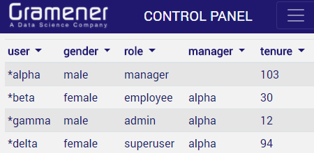
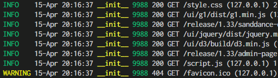

---
title: Gramex 1.33 Release Notes
prefix: 1.33
...

[TOC]

## Quickstart tutorial

Gramex now has a [quickstart tutorial](../../quickstart/) that explains how to
create a Gramex application, step-by-step.

## Sanddance

Gramex now includes [g1 0.6.0](https://www.npmjs.com/package/g1). This features
a [sanddance component](https://code.gramener.com/cto/g1/#sanddance). It moves
elements smoothly based on pre-defined and custom layouts.

Here's a [sample script](sanddance-demo.js):

<svg id="sanddance-demo"></svg>
<script src="../../ui/d3/build/d3.min.js"></script>
<script src="../../ui/g1/dist/g1.min.js"></script>
<script src="sanddance-demo.js?v8"></script>

## FormHandler charts

FormHandler now supports [Vega-Lite](https://vega.github.io/vega-lite/) and
[Vegam](https://www.npmjs.com/package/vegam) charts, which are easier to create.
[Read the documentation](../../formhandler/#formhandler-vega-charts).

Here's an example:

<div style="margin-bottom:130px"><!-- fixes bug: div is shorter than the svg  -->
  <script src="../../formhandler/vega-lite-3?_format=scattertrellis"></script>
</div>
<script src="https://cdn.jsdelivr.net/npm/vega@3.2.1/build/vega.min.js"></script>
<script src="https://cdn.jsdelivr.net/npm/vega-lite@2.3.1/build/vega-lite.min.js"></script>


## Add roles to users

All [auth handlers support lookup attributes](../../auth/#lookup-attributes).
This lets you add a roles (or any other additional information) to any user
using any auth mechanism.

For example, a user logs may in via LDAP, but the project adds a new "role"
column for the user. This is maintained in a database or local file, and
will be editable via the [admin module](#admin-module) in the next release.

[See the documentation](../../auth/#lookup-attributes).

## Screenshot alerts as user

Smart alerts can [email dashboard screenshots](../..//alert/#email-dashboards).
Gramex alerts sends a request to CaptureHandler, which passes the request to the
dashboard.

By specifying a `user:` object in the configuration, alerts can now take a
screenshot *logging in as a specific user*. (Currently, there are a few
limitations. Only one user is supported per alert. This requires two Gramex
instances. Both problems will be addressed soon.)

(To achieve this, CaptureHandler has been modified to pass on any custom HTTP
headers sent y the browser directly to the dashboard.)

## Admin module

An early version of the [admin module](../../admin/) is available. Currently,
this is read-only, but will soon have edit capability.



## Multi-process logging

The Gramex console and the saved `gramex.log` files show the port Gramex runs on.



Here, it is clear that the request came to port 9988. This is useful when
multiple Gramex instances are logging into the same `gramex.log` -- which makes
it easier to identify which instance served the page. (It is also useful when
multiple terminal windows are running Gramex, and you don't know which
instance is running on which port.)

This release also fixes a bug that allows multiple Gramex instances to log to
the same file without the file getting locked for backup.

## Other enhancements

- Gramex has an [encryption service](../../auth/#encrypted-user) that lets
  applications log in as other users securely. That is, Gramex can fetch pages
  mimic-ing any user. This is internally used by CaptureHandler in
  [screenshot alerts as user](#screenshot-alerts-as-user).
- [g1.datafilter](https://code.gramener.com/cto/g1/#datafilter-options) supports a
  `namespace:` option to render multiple tables in a page.

## Stats

TODO

- Code base: 23,896 lines (python: 15,067, javascript: 1,363, tests: 8,178)
- Test coverage: 78%

## Upgrade

To upgrade Gramex, run:

```bash
pip install --verbose gramex==1.33
```

This downloads Chromium and other front-end dependencies. That may take time.
