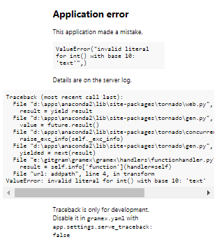
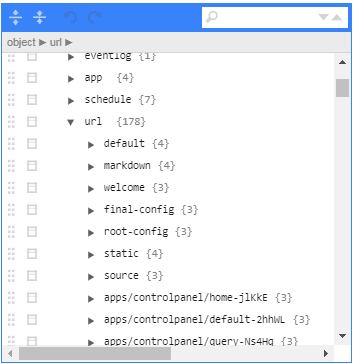
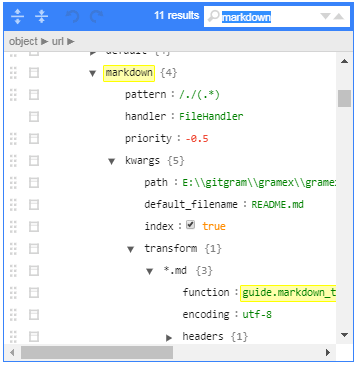

---
title: Gramex 1.34 Release Notes
prefix: 1.34
...

[TOC]

## Server Traceback

Developers can now see [detailed traceback](../../functionhandler/addpath/10/text) on the browser.

[](../../functionhandler/addpath/10/text)

**NOTE**: Traceback is only for development.
Disable it in `gramex.yaml` with `app.settings.serve_traceback: false`

## Config Viewer

Gramex features a built-in [Config Viewer](../../config/configview/) component.

[](../../config/configview/)

[](../../config/configview/)

This currently allows user to view, search through gramex app configuration.

You can embed the viewer in a page,
follow [these instructions](../../config/#config-viewer) in your HTML.

## Developer updates

### AJAX XSRF

When using **AJAX**, no `XSRF` token is required
(for modern browsers that send an `X-Requested-With: XMLHttpRequest` header for AJAX.)

[See the documentation](../../filehandler/#xsrf).

### FormHandler JSON

FormHandler methods accepts `Content-Type: application/json`.
This allows passing JSON data as arguments.

[See the documentation](../../formhandler/#formhandler-json-body).

### Anton font

The Google Font [Anton](https://fonts.google.com/specimen/Anton) is now available
on the Gramex [UI components](../../uicomponents/).

### Vega Examples

Additional [vega-lite](../../formhandler/vegam-examples) and
[vegam](../../formhandler/vegam-examples) examples are added

### Deprecations

- [Session store](../../auth/#session-data) `type: hdf5` is deprecated.
It is very slow and not distributed.

### Others

- `gramex.cache.cache_key(*args)` converts arguments into a string suitable for use as a cache key

## Internal bugfixes

- Session purge should have a different schedule than flush. This will improve performance.
This is resolved.
- [download.vega.js](https://code.gramener.com/cto/gramex/issues/396) should be
 included in package published to [pypi](https://pypi.org/project/gramex/).
This is resolved.


## Stats

- Code base: 24,961 lines (python: 15,161, javascript: 1,438, tests: 8,362)
- Test coverage: 80%

## Upgrade

To upgrade Gramex, run:

```bash
pip install --verbose gramex==1.34
```

This downloads Chromium and other front-end dependencies. That may take time.