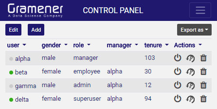

---
title: Gramex 1.35 Release Notes
prefix: 1.35
...

[TOC]

## ModelHandler

[ModelHandler](../../modelhandler/) exposes machine learning models as APIs
that applications can use via Python or over a REST API.

[See the documentation](../../modelhandler/).

## Admin module

[admin module](../../admin/) now let's you add/delete/edit a user. You can also
logout a user and send password-reset email from the interface.



## FormHandler tutorial

Gramex now has a [FormHandler tutorial](../../tutorials/) that explains how to
use FormHandler to read and write from files and databases.

## pip10

Gramex 1.35 onwards now supports installation via pip 10.x.

## Other enhancements

- g1 [$.formhandler](https://code.gramener.com/cto/g1#formhandler) supports
grids via `table: 'grid'`.
- g1 [$.formhandler](https://code.gramener.com/cto/g1#formhandler) tables can be
edited by the user via `edit: true`

## Others

- Gramex is not free for commercial use. Please read the
[LICENSE](https://github.com/gramener/gramex/blob/master/LICENSE.rst) and
terms for non-commercial use.

## Stats

- Code base: 25,382 lines (python: 15,375, javascript: 1,518, tests: 8,489)
- Test coverage: 80%

## Upgrade

To upgrade Gramex, run:

```bash
pip install --verbose gramex==1.35
```

This downloads Chromium and other front-end dependencies. That may take time.
