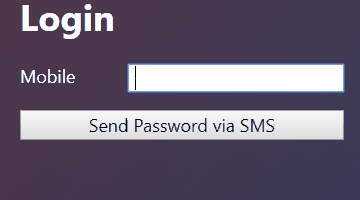

---
title: Gramex 1.36 Release Notes
prefix: 1.36
...

[TOC]

## SMS Auth

Users can log into Gramex just using a mobile phone with a one time password
sent via SMS using [SMSAuth](../auth/#sms-auth). No password or configuration required.



This requires setting up an [SMS service](../sms/).

## Exotel SMS service

Apart from supporting the Amazon SNS API to send SMS messages, Gramex also
supports the [Exotel SMS](https://exotel.com/product-sms/) interface. Exotel
supports high volume transactional messages. More importantly, it supports
delivery status responses -- which Amazon SNS API does not.

## Redis Store

You can now run Gramex instances on multiple machines and load balance them.
User sessions can be shared across instances using [Redis](https://redis.io/)
- a fast in-memory database.

Specifically, nginx need not use
[ip_hash](http://nginx.org/en/docs/http/ngx_http_upstream_module.html#ip_hash).
Users behind a proxy who have the same IP address can still be distributed
across instances.

## Mapviewer

[g1.mapviewer](https://code.gramener.com/cto/g1#g1-mapviewer) lets you create
interactive maps. Mapviewer is an abstraction over `Leaflet` that can
create common GIS applications using configurations.

Mapviewer requires `npm install leaflet d3 d3-scale-chromatic g1`.


[Read Documenation](https://code.gramener.com/cto/g1#g1mapviewer)

## Bug fixes

FormHandler used to create a new database connection for certain kinds of new
queries. This leak is now plugged.
[#423](https://code.gramener.com/cto/gramex/issues/423)

Gramex error templates (like those reporting 500 errors or 404 errors) allowed
unescaped user input. If the URL was `/path<script>alert(0)</script>`, it would
report a HTTP 404 with the script injected into the page. This is fixed.
[#418](https://code.gramener.com/cto/gramex/issues/418)

## Python 3 tests

Gramex test cases automatically run on Python 3, thanks to the new Python 3
build environment in code.gramener.com.
[.gitlab-ci.yml](https://github.com/gramener/gramex/blob/dev/.gitlab-ci.yml) has:

```yaml
validate-py3:
  only: [dev, master]
  tags: [py3]
  script:
    - python setup.py nosetests
```

## Other enhancements

g1 [$.formhandler](https://code.gramener.com/cto/g1#formhandler) table cell
format is more flexible. It can be a function that accepts an object with the
column name, cell value, row data, and full dataset

logviewer now exposes `pd.Series.str` methods to transform data. For example,
you may want lowercase `user.id`

## Stats

- Code base: 25,673 lines (python: 15,602, javascript: 1,518, tests: 8,553)
- Test coverage: 80%

## Upgrade

To upgrade Gramex, run:

```bash
pip install --verbose gramex==1.36
```

This downloads Chromium and other front-end dependencies. That may take time.
