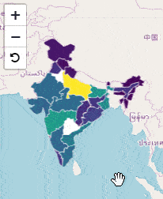

---
title: Gramex 1.39 Release Notes
prefix: 1.39
...

[TOC]

## PyNode

Gramex can allows you to run JavaScript code via `node.js` using `gramex.pynode.node`. Using Gramex FunctionHandlers you can run JavaScript code in node.js. Here is a simple example:

```python
from gramex.pynode import node
from tornado.gen import coroutine, Return

@coroutine
def total(handler):
    result = yield node.js('return Math.abs(x + y)', x=5, y=-10)    # Run code in JS
    raise Return(result)
```

This returns the result:

```json
{"error":null,"result":5}
```

[See the documentation](../../node/).

## UI Components

- [`opacity-**`](../../uicomponents/#text-opacity) {10, 20 .., 80, 90} classes have been added for defining opacity.
`.opacity-10` sets opacity to `10%`. Other classes have similar behavior.
- Accordion examples with `+`, `-` as expand and collapse symbols is added

## MapViewer

[Mapviewer tutorial](../../mapviewer/) covers
[`g1.mapviewer`](https://code.gramener.com/cto/g1#g1-mapviewer) usage with examples.
`g1.mapviewer` is an abstraction over Leaflet that can create common GIS applications using configurations.



## FormHandler

- [FormHandler Table](../../formhandler/flags?_format=table) now supports multiple sorts from the interface.
- [FormHandler Table](../../formhandler/flags?_format=table) now works with numeric greater than `>`, less than `<` opertions.
- [FormHandler](../../formhandler/db?_by=Text&_by=Symbols&_format=html&_c=c3%7Csum&_meta=y&_sort=c3%7Csum):
earlier didn't support `_sort` on `col|agg` columns when using `_by` with SQL engines. This is now fixed.
[#452](https://code.gramener.com/cto/gramex/issues/452)

## Logviewer

[Logviewer](../../logviewer/) documentation now has a section describing how `logviewer.db` is created.
And, covers in detail how metrics are calculated, in particular `session` relation calculations and scenarios.

## Developer Updates

- [uicomponents](../../uicomponents/) now ships `d3-scale-chromatic.js` -- provides sequential, diverging
and categorical color schemes designed to work with `d3-scale`’s `d3.scaleOrdinal` and `d3.scaleSequential`.

## Bug fixes

- Earlier `gramex.cache` size was using `sys.getsizeof`, we now use `gramex.cache.sizeof`.
This fixes [#444](https://code.gramener.com/cto/gramex/issues/444)

## Stats

- Code base: 27,007 lines (python: 16,394, javascript: 1,654, tests: 8,959)
- Test coverage: 79%

## Upgrade

To upgrade Gramex, run:

```bash
pip install --verbose gramex==1.39
```

To upgrade apps dependencies, run:

```bash
gramex setup --all
```

This downloads Chromium and other front-end dependencies. That may take time.
