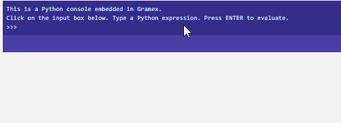
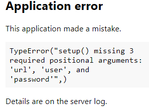
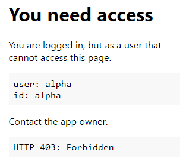

---
title: Gramex 1.41 Release Notes
prefix: 1.41
...

[TOC]

## Python console

[Admin module](../../admin/admin/) now comes with web-based python console.  This embedded Python console executes within the context of the Gramex instance.



[Read the documentation](../../admin/) on how to set it up admin page.

## Error Reporting

We now report error more meaningful information on incorrect `gramex.yaml` `url` config.
If a `url:` configuration has an error (e.g. the `kwargs` are wrongly specified)

```yaml
url:
  invalid:
    pattern: /invalid
    handler: DBAuth    # do not add any kwargs
```

We now report error message like



## g1 urlfilter

Gramex guide now features g1 [urlfilter examples](../../g1)

Contributed by [@jaiprakash.siyyadri](https://code.gramener.com/jaiprakash.siyyadri)

## AJAX Uploads

Guide now has example for UploadHandler [AJAX usage via DropZone](../../uploadhandler/#ajax-uploads)

## 40X reporting

We now show user info in `403` error.



Added a separate `401` error page

## Favicon

Most applications fail to add a favicon.ico. This leads to several HTTP 404
errors, wasted bandwidth and wasted computing

By default, Gramex now provide a default `favicon.ico` from the Gramex/ directory.

No change is required in the code.

## Gramex Update

Gramex update app now [shows usage stats](https://gramener.com/gramex-update/).
Currently, restricted to @gramener folks.

## Developer Updates

### g1
[`g1.js`](https://code.gramener.com/cto/g1) is upgraded to `0.9.0`

### UI Componenets
UI Componenet's [`Bootstrap`](../../uicomponents/) is upgraded to `4.1`.
Read the highlights [here](http://blog.getbootstrap.com/2018/04/09/bootstrap-4-1/#highlights)

### Logviewer

We've now added `cutoff_buffer` parameter to add `minutes` to first and last request in a session,
while calculating [logviewer](../../logviewer/) session time.

### Guide Search

We've added a search box to [guide home page](../../), to make it easier for you to search topics.

### Guide Link Checker

[Link Checker](../../linkcheck/) tests if all links on the Gramex Guide are working.

### Install

Gramex [installation](../../install/) instructions are now simplified a bit.

## Bug fixes

- Allow SimpleAuth to have no `password:` section.
Fixes [#482](https://code.gramener.com/cto/gramex/issues/482)
- Earlier [FormHandler pptx-table](../../formhandler/#formhandler-formats) example threw error due to missing `input.pptx`.
This is noe fixed [#463](https://code.gramener.com/cto/gramex/issues/482)
- `gramex.cache.save(excel)` is now fixed to preserve column order

## Stats

- Code base: 27,844 lines (python: 16,737, javascript: 1,772, tests: 9,335)
- Test coverage: 79%

## Upgrade

Note: `gramex >= 1.41` requires `Anaconda >= 5.2.0`

To upgrade Gramex, run:

```bash
pip install --verbose gramex==1.41
```

To upgrade apps dependencies, run:

```bash
gramex setup --all
```

This downloads Chromium and other front-end dependencies. That may take time.
