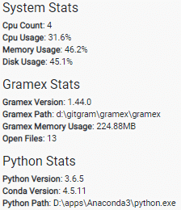

---
title: Gramex 1.44 Release Notes
prefix: 1.44
...

[TOC]

## Vega gallery

[](../../chart/gallery.html)

[Vega](../../chart) is a high-level implementation of the grammar of graphics, allowing the creation of charts with the power of D3 but with greater ease.

We've released a collection of commonly used charts under [Vega gallery](../../chart/gallery.html).

[](../../chart/gallery.html)

This will be continuously updated, watch out for this space.

## Admin gramex info

[Admin page](../../admin/admin-kwargs/?tab=info) now shows information about Gramex and the server.

Broadly in these sections

- System stats: CPU usage (%), memory usage (total, %), disk usage (total, %)
- Python stats: Python version, Conda version, Python path
- Gramex stats: Gramex version, Gramex path, Gramex memory usage, Number of open files

[](../../admin/admin-kwargs/?tab=info)

This information is exposed under [admin-page/info](../../admin/admin-kwargs/info) endpoint

(Contributor: [@jatin.balodhi](https://code.gramener.com/jatin.balodhi))

## Groupmeans

`gramex.ml.groupmeans` analytical model helps you identify the most significant influencer of each metric.
By coupling with [`FormHandler`](../../formahanhdler/)'s filter, provides you a powerful API to build exploratory interfaces.

For example, Groupmeans with `FormHandler` can be exposed as

```yaml
url:
  groupmeans-insights:
    pattern: /$YAMLURL/insights-api
    handler: FormHandler
    kwargs:
      url: $YAMPATH/sales-data.csv
      modify: groupmeans_app.groupmeans_insights(data, handler)
```

And in `groupmeans_app.py`

```python
import gramex.ml

def groupmeans_insights(data, handler):
    args = handler.argparse(
        groups={'nargs': '*', 'default': []},
        numbers={'nargs': '*', 'default': []},
        cutoff={'type': float, 'default': .01},
        quantile={'type': float, 'default': .95},
        minsize={'type': int, 'default': None},
        weight={'type': float, 'default': None})
    return gramex.ml.groupmeans(data, args.groups, args.numbers,
                                args.cutoff, args.quantile, args.weight)
```

Read more on [guide](../../modelhandler/#groupmeans)

Also, read insights derived from [National Acheivement Survey data](../../groupmeans/)

If you're used gramex 0.x earlier, you can relate to [autolysis.groupmeans](https://learn.gramener.com/docs/groupmeans.html.html)

## RMarkdown

With [RMarkdown](../../r#rmarkdown) documents you can weave together narrative text and code to produce elegantly formatted outputs.

You can now render RMarkdown files as HTML outputs using Gramex's [`FileHandler`](../../filehandler/) with `rmarkdown` transform.

```yaml
url:
  r/rmarkdown:
    pattern: /$YAMLURL/(.*Rmd)
    handler: FileHandler
    kwargs:
      path: $YAMLPATH     # path at which Rmd files (.*Rmd) are located
      transform:
        "*.Rmd":          # Any file matching .Rmd
          function: rmarkdown(content, handler)
          headers:
            Content-Type: text/html
            Cache-Control: max-age=3600
```

This [RMarkdown-story.Rmd](https://github.com/gramener/gramex/blob/dev/gramex/apps/guide/r/RMarkdown-story.Rmd) file is rendered as

[](../../r/RMarkdown-story.Rmd)

## FormHandler supports URLs

You can now read files from a HTTP or HTTPS URL (public datasets, external hosted, etc!)

```yaml
    ... # FormHandler
    # This URL is read once and cached forever
    url: http://www-bcf.usc.edu/~gareth/ISL/Advertising.csv
    ext: csv   # Explicitly specify the extension for HTTP(S) urls
```

This makes it possible for you to create charts, stories from 3-rd party data endpoints.

You can bust the cache using parameters

## EULA

Starting `1.44`, when running gramex, the application prompts the user on the command line:

```

-------------------------------------------------------------------------
Read the license agreement at https://learn.gramener.com/guide/license/

Do you accept the license (Y/N):
```

Once the user accepts the license, the prompt is not shown thereafter.

Users can also accept the license by running `gramex license accept` once on the command line. This calls `gramex.license.accept(...)`

## g1

gramex [uicomponents](../../uicomponents) now ships with [`g1`](https://code.gramener.com/cto/g1) `0.10.0`

In this version, two changes were introduced to [mapviewer](../../mapviewer/)

- [g1.mapviewer](https://code.gramener.com/cto/g1#g1-mapviewer) supports TopoJSON
- [g1.mapviewer](https://code.gramener.com/cto/g1#g1-mapviewer) supports popups (in addition to tooltips).
  **Breaking change**: `tooltip:` & `tooltipOptions:` were inside `attrs:`.
  Now they are 1 level higher, alongside `attrs:`.

## Bug fixes

- `gramex init` fail if git is not installed. This is now fixed.

## Stats

- Code base: 28,560 lines (python: 17,215, javascript: 1,852, tests: 9,493)
- Test coverage: 78%

## Upgrade

Note: `gramex >= 1.41` onwards requires `Anaconda >= 5.2.0`

To upgrade Gramex, run:

```bash
pip install --verbose gramex==1.44
```

To upgrade apps dependencies, run:

```bash
gramex setup --all
```

This downloads Chromium and other front-end dependencies. That may take time.
