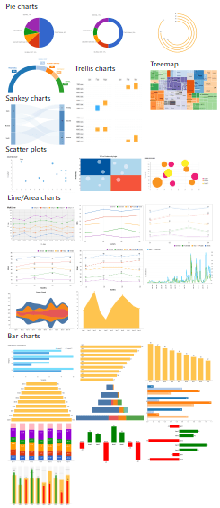

---
title: Gramex 1.45 Release Notes
prefix: 1.45
...

[TOC]

## Vega gallery

Treemap and circle grid examples are added to [chart gallery](../../chart/gallery.html)

[](../../chart/gallery.html)

(Contributors from: [@vikky.a](https://code.gramener.com/vikky.a))

More examples will be added, watch out for this space.

## Admin

### Auth

[Admin module](../../admin/) can now be protected with `ADMIN_AUTH` option.

You can configure the admin page as follows:

```yaml
import:
  admin/admin-kwargs:
    path: $GRAMEXAPPS/admin2/gramex.yaml
    YAMLURL: /$YAMLURL/admin-kwargs/        # URL to show the admin page at
    ADMIN_KWARGS:
      logo: https://gramener.com/uistatic/gramener.png      # Logo URL
      title: Admin  Page Options                            # Navbar title
      components: [info, users, shell]                      # Components to show
      theme: '?primary=%2320186f&dark=%2320186f&font-family-base=roboto&body-bg=%23f8f8f8'  # Bootstrap theme query
    ADMIN_AUTH:
      membership:
        email: [admin1@example.org, admin2@example.org]     # Only allow these users
```

The `ADMIN_AUTH` section is the same as specifying the `auth:`
[authorization](../../auth/#authorization) on all admin pages.

### Actions

[Admin page](../../admin/admin/?tab=users) user table's actions were broken. They now work as expected. 

**Breaking Change:** `g1.formhandler` `actions` now accepts array of objects as configuration.

## g1

gramex [uicomponents](../../uicomponents) now ships with [`g1`](https://code.gramener.com/cto/g1) `0.10.1`

In this version, two changes were introduced

- [$.formhandler](https://code.gramener.com/cto/g1#formhandler) editing supports custom UI elements like datepicker, dropdown, etc
- [g1.mapviewer](https://code.gramener.com/cto/g1#g1-mapviewer) supports map legends

## UI Components

### dropzonejs

The [UI Component Library](../../uicomponents) now ships [dropzonejs](https://www.dropzonejs.com/), provides drag-and-drop AJAX uploads with progress bars.

Using [UploadHandler](../../uploadhandler/#ajax-uploads) you can upload files and manage them.

Here is a sample configuration:

```yaml
 # ... import uicomponents
url:
  uploadhandler:
    pattern: /$YAMLURL/upload
    handler: UploadHandler
    kwargs:
      path: $GRAMEXDATA/apps/guide/upload/    # ... save files here
```

```html
<link rel="stylesheet" href="ui/dropzone/dist/min/dropzone.min.css">
<form action="upload" class="dropzone"></form>
<script src="ui/dropzone/dist/min/dropzone.min.js"></script>
```

Read more on [guide](../../uploadhandler/#ajax-uploads)

### bootstrap-select

`bootstrap-select` is upgraded to `1.13.3`.
Fixes [#560](https://code.gramener.com/cto/gramex/issues/560) and
[other issues](https://github.com/snapappointments/bootstrap-select/blob/v1.13.0-dev/CHANGELOG.md#v1133-2018-10-15)

## Developer Updates

- `gramex >= 1.45` is compatible with cachetools `3.0.0` [#557](https://code.gramener.com/cto/gramex/issues/557)
- `gramex` is tested on `tornado>=5` and `python3`

## Stats

- Code base: 28,685 lines (python: 17,212, javascript: 1,852, tests: 9,621)
- Test coverage: 78%

## Upgrade

Note: `gramex >= 1.41` onwards requires `Anaconda >= 5.2.0`

To upgrade Gramex, run:

```bash
pip install --verbose gramex==1.45
```

To upgrade apps dependencies, run:

```bash
gramex setup --all
```

This downloads Chromium and other front-end dependencies. That may take time.
