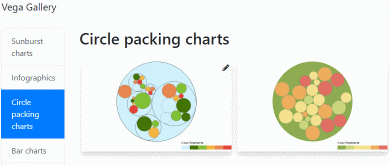
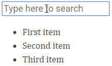

---
title: Gramex 1.49 Release Notes
prefix: 1.49
...

[TOC]

## Chart gallery

The [Vega chart gallery][chart-gallery]
has a wide collection of charts that you can copy-paste from.

[][chart-gallery]

The gallery current has:

- [Arc diagram](https://learn.gramener.com/guide/chart/gallery.html#?category=Arc_Diagram)
- [Bar charts](https://learn.gramener.com/guide/chart/gallery.html#?category=Bar_charts)
- [Box plots](https://learn.gramener.com/guide/chart/gallery.html#?category=Box_Plots)
- [Circle packing charts](https://learn.gramener.com/guide/chart/gallery.html#?category=Circle_packing_charts)
- [Infographics](https://learn.gramener.com/guide/chart/gallery.html#?category=Infographics)
- [Line area charts](https://learn.gramener.com/guide/chart/gallery.html#?category=Line_Area_charts)
- [Parallel coordinates](https://learn.gramener.com/guide/chart/gallery.html#?category=Parallel_Coordinates)
- [Pie charts](https://learn.gramener.com/guide/chart/gallery.html#?category=Pie_charts)
- [Sankey charts](https://learn.gramener.com/guide/chart/gallery.html#?category=Sankey_charts)
- [Scatter plots](https://learn.gramener.com/guide/chart/gallery.html#?category=Scatter_plots)
- [Sunburst charts](https://learn.gramener.com/guide/chart/gallery.html#?category=Sunburst_charts)
- [Treemaps](https://learn.gramener.com/guide/chart/gallery.html#?category=Treemap)
- [Trellis charts](https://learn.gramener.com/guide/chart/gallery.html#?category=Trellis_charts)
- [Word cloud](https://learn.gramener.com/guide/chart/gallery.html#?category=Word_Cloud)

[chart-gallery]: https://learn.gramener.com/guide/chart/gallery.html

## Better gramex init

`gramex init` adds a login page, better default layouts, and an opinionated file
structure:

- Lint configurations: `.editorconfig`, `.eslintrc.js`, `.flake8`, `.stylelintrc.js`, `.htmllintrc`
- Git and Gitlab configs: `.gitignore`, `.gitlab-ci.yml`,
- `README.md`
- `favicon.ico` -- the Gramex favicon is copied by default. Change it
- `gramex.yaml` -- enhanced for a template home page, login & logout pages
- `index.html` -- features a richer navbar, user info and dummy dashboard
- `login.html` -- a simple but fully featured login form
- `template-navbar.html` -- a navbar template you can import in all pages
- `style.css` -- all CSS for the app goes into this single file
- `<appname>.py` -- all Python code for the app goes into this single file
- `assets/` -- a folder that contains non-version-controlled assets (e.g. `img/`, `data/`, `fonts/`, etc.)
- `js/` -- common JS code across applications
- `error/` -- error handling templates.

## g1 animated templates

[g1 0.12](https://www.npmjs.com/package/g1) supports
[template animation](https://code.gramener.com/cto/g1/blob/master/docs/template.md#template-animation)
via virtualdom:


```html
<script type="text/html" data-engine="vdom">
  <div class="red-ball" style="transition: all 1s ease;margin-left:<%= x %>px"></div>
</script>
<script>
var x = 300
// Re-rendering the template just updates the changed styles / attributes.
// DOM elements are not deleted. Just updated.
setInterval(function() {
  $('script[type="text/html"]').template({x: x})
  x = 300 - x
}, 2000)
</script>
```

## g1 $.search

[g1 0.12](https://www.npmjs.com/package/g1) supports
[search as you type](https://code.gramener.com/cto/g1/blob/master/docs/search.md):



```html
<input type="search" data-search="@text" data-target=".list li" data-hide-class="d-none">
<ul class="list">
  <li>First item</li>
  <li>Second item</li>
  <li>Third item</li>
</ul>
<script>
$('body').search()
</script>
```

## Bootstrap 4.2

Gramex UI components now use [Bootstrap 4.2](https://getbootstrap.com/docs/4.2/)
instead of Bootstrap 4.1. This is backward compatible. It features
[spinners](https://getbootstrap.com/docs/4.2/components/spinners/),
[switches](https://getbootstrap.com/docs/4.2/components/forms/#switches),
[toast notifications](https://getbootstrap.com/docs/4.2/components/toasts/)
and new utility classes like `.font-weight-lighter`, `.text-decoration-none`,
negative margins like `.m-n3`, etc.

## Bugfixes

- [GoogleAuth](../../auth/#google-auth) now works with Tornado 5.1
- [gramex.ml.translater](../../translate/) was misspelt as translator. Both work now
- [RedisStore](../../auth/#session-data) now accepts additional parameters like `password:`
- [gramex.cache.open](../../cache/#data-caching) for `.md` files nows uses the
  `toc` extension instead of the deprecated `headerid` extension. This is mostly
  backward-compatible
- [CaptureHandler](../../capture/) raises HTTP 400 (not 200) if the URL is missing
- [ProxyHandler](../../proxyhandler/) redirects `Location:` headers with relative urls correctly
- [FileHandler templates](../../filehandler/#templates) support variables like
  `request`, `current_user`, etc. in line with [Tornado](http://www.tornadoweb.org/en/stable/guide/templates.html#template-syntax)
- [UI components](../../uicomponents/) are accessible even if `BaseHandler.auth` restricts users

## Stats

- Code base: 29,357 lines (python: 17,650, javascript: 2,171, tests: 9,907)
- Test coverage: 78%

## Upgrade

To upgrade Gramex, run:

```bash
pip install --verbose gramex==1.49
gramex setup --all                      # Set up UI components, puppeteer, etc
```
