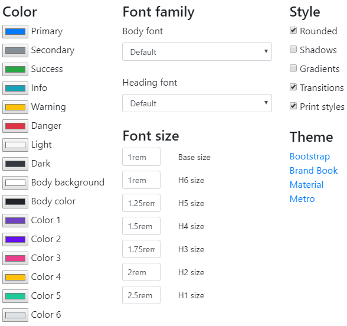

---
title: Gramex 1.50 Release Notes
prefix: 1.50
...

[TOC]

## Gramex has a new test framework

Gramex now has a [test framework](../../test/). This automates Gramex apps testing.

<link rel="stylesheet" type="text/css" href="../../node_modules/asciinema-player/resources/public/css/asciinema-player.css">
<asciinema-player src="../../test/pytest.rec" cols="100" rows="20" idle-time-limit="0.5" autoplay="1"></asciinema-player>

## Translations are easier

[$.translate()](../../translate/) from [g1](https://www.npmjs.com/package/g1)
makes it easy to translate any content in a page. For example:

```html
<ul>
  <li lang-target="de">This is translated into <em>German</em></li>
  <li lang-target="nl">This is translated into <em>Dutch</em></li>
</ul>
<script>$('[lang-target]').translate({url: './translate'})</script>
```

... renders:

- Dies wird in übersetzt *Deutsche*
- Dit is vertaald in *Nederlands*

[Gramex translate](../../translate/) auto-detects the source languages if you
leave the `source` blank. This helps when the source data has multiple languages
(e.g. customer survey responses) and needs to be translated.

A few bugs have been fixed.

- The [Translate API](../../translate/#translate-api) returns results *in the
  same order* as the input.
- Parallel requests are thread-safe.

## UI components have new colors, utilities and libraries

[FontAwesome 5 free](https://fontawesome.com/) is now available, in addition to
[FontAwesome 4](https://fontawesome.com/v4.7.0/). FontAwesome 5 is the new
default in `gramex init`. To use it:

```html
<link rel="stylesheet" href="ui/@fortawesome/fontawesome-free/css/all.min.css">
```

[UI components](../../uicomponents/) now support:

- [Unlimited custom colors](../../uicomponents/#colors). 6 custom colors are
  added by default, allowing 14 custom colors (including the default 8 from
  Bootstrap). But you can define as many custom colors as you like
- [Letter spacing utilities](../../uicomponents/#letter-spacing): `.ls-1`, `.ls-2`, etc
- [Line height utilities](../../uicomponents/#line-height): `.lh-1`, `.lh-2`, etc.
- [Z-Index utilities](../../uicomponents/#z-index)
- [Full-page height utilities](../../uicomponents/#full-height)

The new UI theme picker looks like this:




## g1 upgraded to 0.13

[g1](https://www.npmjs.com/package/g1) is upgraded from 0.12 to 0.13. This
release features:

- [$.translate](../../translate/) which translates content using the Gramex Translate API
- `$.dropdown` which supports objects with different names and values
- Minor bug-fixes

## CORS and FormHandler validation docs

- [How to use CORS](../../deploy/#cors) to send AJAX requests across multiple
  Gramex instances
- [FormHandler validation](../../formhandler/#formhandler-validation) explains
  how to validate FormHandler queries and updates
- [README on PyPI](https://pypi.org/project/gramex/) is more descriptive,
  helping new users navigate better

## Encrypt service is deprecated

The `encrypt:` service is no longer used. Gramex internally uses Tornado signed
values for encryption instead.

The `encrypt:` service provided a way for Gramex services to share secret
information. For example, between CaptureHandler and the page, or between alerts
and CaptureHandler. This used RSA private keys. But this is a complex mechanism.
Instead, we now use Tornado's built-in mechanism that uses the `cookie_secret`
setting in the application.

## Bugfixes

- [CaptureHandler](../../capturehandler/) does not crash if selector are missing
- [EmailAuth](../../auth/#email-auth) supports redirection
- Invalid URL query parameters (like `?x=%f4`) are ignored

## Stats

- Code base: 29,357 lines (python: 17,984, javascript: 2,172, tests: 9,922)
- Test coverage: 79%

## Upgrade

To upgrade Gramex, run:

```bash
pip install --verbose gramex==1.50
gramex setup --all                      # Set up UI components, puppeteer, etc
```

<script src="../../node_modules/asciinema-player/resources/public/js/asciinema-player.js"></script>
