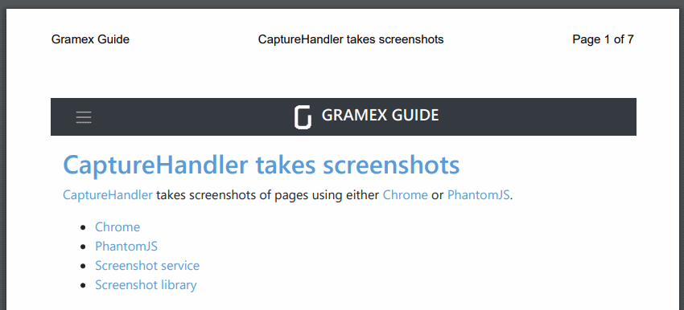

---
title: Gramex 1.51 release notes
prefix: 1.51
...

[TOC]

## Gramex is open source

Gramex was earlier available for non-commercial use. Now, Gramex has split into
two parts.

- Gramex (open source) is free under the MIT license. This allows commercial use
- Gramex enterprise has authentication features typically used in enterprises.
  This is free for non-commercial use. For commercial use, email
  `license@gramener.com`

The installation commands are now:

```bash
pip install gramex              # Install open source version
pip install gramexenterprise    # Install enterprise version (non-commercial use)
```

## Add header and footer to PDF screenshots

PDF screenshots now support headers and footers.



This feature in [CaptureHandler](../../capturehandler/) lets you:

- Include any HTML you want, including styles and images
- Include variables for page number, total pages, title, URL and date
- Use a flexible layout with content in the left, middle, or right.
  You may split this further into any number of sections.


## Enhanced security: Protect against bots

[Gramex auth](../../auth/#recaptcha) prevents againt bot attacks using
[CAPTCHAs](https://en.wikipedia.org/wiki/CAPTCHA) in the login screen. This
configuration will add [reCAPTCHA](https://www.google.com/recaptcha/) support.

```yaml
url:
  login-page:
    kwargs:
      recaptcha:
        key: YOUR-RECAPTCHA-KEY
        secret: YOUR-RECAPTCHA-SECRET
```

The CAPTCHA is invisible. Human users do not need to do anything different.
Bots will not be able to log in.


## Test application on multiple screen resolutions

The [Gramex pytest plugin](../../test/) supports 3 new commands:

- `resize: [800, 600]` runs UI tests on a browser with 800x600 resolution. You
  may set any value
- `name: ...` names tests. You can run specific tests using `pytest -k <name>`.
- `title: ...` checks whether the page title matches a value

DOC: upgrade g1 from 0.13 to 0.14 [S Anand]


## Documentation is more interactive

The [g1 interactive library](../../g1/) documentation shows examples in-place.
You can see the effect of the code directly. Some examples:

- [g1 urlfilter](../../g1/docs/urlfilter.md)
- [g1 template](../../g1/docs/template.md)

The guide now uses the Gramex [UI component library](../../uicomponents/). We also
have new documentation on:

- [Frequently asked questions](../../faq/)
- [Setting viewport size in CaptureHandler](../../capturehandler/)
- [How FormHandler transforms work](../../formhandler/#formhandler-transforms)

## Bugfixes

FormHandler processes data much better. Specifically:

- FormHandler edits now infer types even for files. Edits preserve the types.
- FormHandler updates would fail if the metadata had NumPy types. Now we use
  CustomJSONEncoder to handle these
- FormHandler supports a [date parsing option](../../formhandler/#date-parsing)
  option that lets you pick which columns in files should be treated as dates.
  You can also specify the date format for JSON output (defaults to ISO)

This apart, run `gramex --watch=False` disables auto-reload of `gramex.yaml`
files. This helps when running apps that are final (e.g. in production) and
should not be refreshed automatically.

## Stats

- Code base: 29,983 lines (python: 17,135, javascript: 2,852, tests: 9,996)
- Test coverage: 80%

## Upgrade

To upgrade Gramex, run:

```bash
pip install --upgrade gramex
pip install --upgrade gramexenterprise    # If you use DBAuth, LDAPAuth, etc.
gramex setup --all
```
