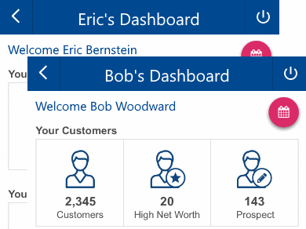
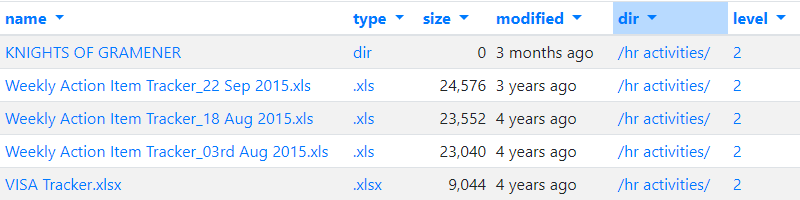
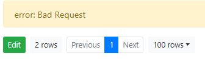
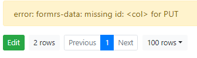

---
title: Gramex 1.52 release notes
prefix: 1.52
...

[TOC]

## Auto-complete with snippets on Visual Studio Code

The
[gramexsnippets]((https://marketplace.visualstudio.com/items?itemName=gramener.gramexsnippets))
[Visual Studio Code](https://code.visualstudio.com/) extension lets you build
Gramex applications much faster. Just start typing `grx-` in any `gramex.yaml`
file to see the handler configurations.


## Search-engine friendly file URLs

You can now create URLs like

- `/dashboard/page` instead of `/dashboard/page.html`
- `dashboard/chart/bar` instead of `dashboard/chart.html?type=bar`

[FileHandler](../../filehandler/) supports mapping URLs to pages flexibly.
This makes links simple for humans and friendly for [search
engines](https://support.google.com/webmasters/answer/76329?hl=en).

Here's an example:

```yaml
url:
  dashboards:
    pattern: /dashboard/(.*)                # Anything under /dashboard/ is mapped
    handler: FileHandler
      path:
        page: dashboard/page.html           # /dashboard/page maps to page.html
        chart/(.*): dashboard/chart.html    # /dashboard/chart/... maps to chart.html
      auth: true                            # All of these pages have auth
```


## Smart alerts send personalized dashboards as attachments

[Smart alerts](../../alerts/) sent attachments capturing dashboards as seen by
any single logged-in user. But now, the same alert can send dashboards as viewed
by different users.

This lets you send each user an attachment with their personalized dashboard.

```yaml
alert:
  send-dashboard:
    # ... alert configuration goes here...
    attachments:
      - http://server/capturehandler/?url=http://server/dashboard&ext=pdf
    user:
      id: '{{ row['email'] }}     # Attach file as view by user in the "email" column
```




## Test pages created by JavaScript

If we use JavaScript to dynamically load data and create a page, the contents
may not be available when the page is loaded.

Rather than wait for a fixed number of seconds, the
[pytest Gramex plugin](../../test/) plugin supports a
`wait: {selector: <selector>}` that waits until `<selector>` has been created.

```yaml
uitest:
  - fetch: 'http://example.org/javascript-page'
  - wait:
      selector: '.chart'  # Wait until chart is created
      timeout: 20         # ... but not for longer than 20 seconds
```

You can also wait for any JavaScript expression. For example:

```yaml
uitest:
  - fetch: 'http://example.org/javascript-page'
  - wait:
      script: 'window.renderComplete === true'  # Wait for this JS expression
```

It also now supports:

- `hover:` to simulate hovering on any element
- `clear:` to clear the value in any input


## Load balancing with authentication across domains

[Gramex session cookies](../../auth/#sessions) can be specified for wildcard
domains:

```yaml
app:
  session:
    domain: .acme.com     # Note the "." in front of the domain
```

... then you can run Gramex on multiple servers within the same domain and share
cookies. For example, a user who is logged in on `app1.acme.com` is also logged
in as the same user in `app2.acme.com`.


## Templates refresh immediately when included files are updated

If you refresh `page.html` which has a [template](../../filehandler/#templates)
include ``, then the output is refreshed if
`template.html` is modified.

(Earlier, there was a bug. The output refreshed if `page.html` is modified, but
not if `template.html` is modified.)


## Alerts can be synchronized across time-zones

[Schedulers](../../scheduler/) and [alerts](../alerts/) support a `utc: true`.
This interprets the schedule in
[UTC time zone](https://en.wikipedia.org/wiki/Coordinated_Universal_Time)
instead of the local time.

```yaml
schedule:
    hours: 6    # Run daily at 6am
    utc: true   # GMT (or UTC). Set false for local server time
```

This helps when you have servers on multiple domains. For example, if developers
are in Israel and the server is in Japan, using `utc: true` runs the alerts
at the same time in both servers. `utc: false` runs them at 6 am local time.


## Browsing files with FormHandler is simpler

[FormHandler](../../formhandler/#formhandler-directory-listing) lets you
[browse files](../..//formhandler/dir?_format=html&_c=dir&_c=name&_c=size&_c=type&_sort=-size).
The result now has 2 new columns:

- `dir`: relative path of the file or directory from the root
- `level`: number of folder levels from root to the file



## FormHandler is more flexible

[FormHandler functions](../../formhandler/#formhandler-functions) accept
`handler` as a variable. This lets you transform the data using URL query
parameters.

For example, if the URL has `?group=city`, you can add
`function: data.groupby(handler.args.group).sum()` to group
(or run any calculation) based on a user-provided input.

FormHandler also reports errors in a more friendly way. Instead of this:



... we now see:



[FormHandler tables](../../g1/docs/formhandler.md) now allow sorting by multiple columns.


# New graphics capability with d3 v5

Gramex bundles d3 v5 under [ui/d3v5/](../../ui/d3v5/). This features new charts such as contours and equalEarth projections


## Statistics

The Gramex code base has:

- 17,197 lines of Python
- 2,852 lines JavaScript
- 10,071 lines of test code
- 81% test coverage

## How to upgrade

To upgrade Gramex, run:

```bash
pip install --upgrade gramex
pip install --upgrade gramexenterprise    # If you use DBAuth, LDAPAuth, etc.
gramex setup --all
```
