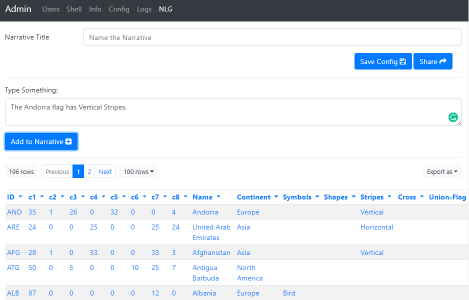

---
title: Gramex 1.53 release notes
prefix: 1.53
...

[TOC]

## Natural Language Generation

Gramex has a library and interface for Natural Language Generation. Admins can
upload datasets, describe them in English, and Gramex automatically creates a
template out of it. These templates are dynamic (based on data) and can be
embedded in dashboards

The feature is in beta, and the documentation is not available yet. But you can
preview it on the [admin page](../../admin/admin/?tab=nlg).



## Gramextest makes testing easier

[Gramextest](../../test/) has several new features:

- `skip: true` lets you skip tests until you run `skip: false`
- `debug: true` pauses on every step until you run `debug: false`
- `python: cmd` runs a Python command. This can access global variables set in `script:`
- `script: cmd` runs a JavaScript command. This can access globals variaables set in `python:`
- `print: selector` prints the HTML contents of a selector
- `mark: group` groups tests together into groups
- `browsers:` supports a `mobile:` option that lets you specify mobile simulation

A blank `tests/gramextest.yaml` is now included in [gramex init](../../init/).

## g1 features fuzzy search

[g1.fuzzysearch](../../g1/docs/fuzzysearch.md) lets you match strings
approximately. This makes search-as-you-type much easier.

[g1 is upgraded to 0.16.1](../../g1/CHANGELOG.md).
This improves [$.template](../../g1/docs/template.md) and
the `link:` attribute in [FormHandler](../../g1/docs/formhandler.md) columns.

[Vega is upgraded to 5.0](https://github.com/vega/vega/releases/tag/v5.0.0).


## Templates support UI modules

Tornado supports a feature called
[UI Modules](https://www.tornadoweb.org/en/stable/guide/templates.html#ui-modules).
This lets you import template files like calling functions.

[FileHandler templates](../../filehandler/##ui-modules) now support this feature.
You can use:

```html
This is the parent template.
 -- this template is embedded here.
```

## Statistics

The Gramex code base has:

- 18,345 lines of Python
- 3,574 lines JavaScript
- 10,354 lines of test code
- 81% test coverage

## How to upgrade

To upgrade Gramex, run:

```bash
pip install --upgrade gramex
pip install --upgrade gramexenterprise    # If you use DBAuth, LDAPAuth, etc.
gramex setup --all
```
