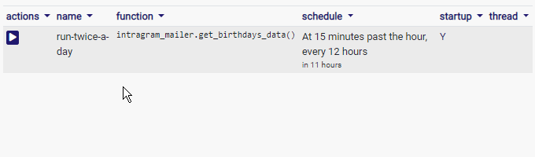
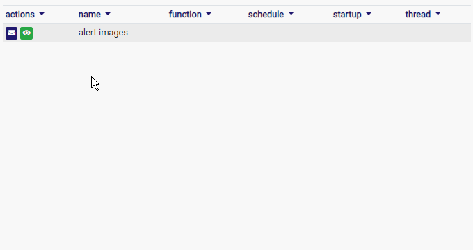
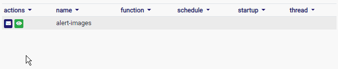
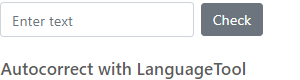
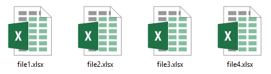
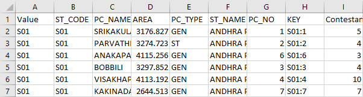
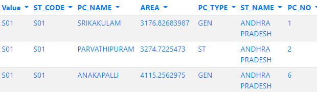

---
title: Gramex 1.54 release notes
prefix: 1.54
...

[TOC]

## Admin UI features alerts and schedules

The [Admin UI](../../admin/admin/) features 2 new tabs for schedules and alerts.


### Admin UI for Schedule

The [Admin UI for Schedule](../../admin/admin/schedule) tells you which
schedules will run when, and lets you manually trigger them. This is useful to
test schedules, and to run them on demand.



### Admin UI for Alert

The [Admin UI for Alert](../../admin/admin/schedule) tells you which alerts will
run when, and lets you *preview the emails* as well as manually trigger them.
This is useful to test alerts, and to run them on demand.





### Admin components URL changed

**This is a breaking change**. If you use the [admin page](../../admin/) with
*components* using JavaScript, the URLs have changed. You should:

- Replace `admin/users` with `admin/users-data`
- Replace `admin/webshell` with `admin/webshell-data`
- Replace `admin/info` with `admin/info-data`

For example:

```js
  // This works before 1.54, but NOT from 1.54
  $('.users').formhandler({ src: 'admin/users' })
  // Replace it with:
  $('.users').formhandler({ src: 'admin/users-data' })
```


## LanguageTool app

Gramex bundles [LanguageTool](../../languagetool/) -- a proofreading application
that can correct grammar automatically. This can be used to improve the auto-
generated wording from natural language generation. For example:



[Learn more about how to use LanguageTool in Gramex](../../languagetool/)

## New data formats

Gramex can now read from [Feather](https://blog.rstudio.com/2016/03/29/feather/)
and [Parquet](https://parquet.apache.org/) files.

### Feather

Feather is a data format that can be used to exchange data between Python, R,
Julia and other languages. It is *extremely fast*, and is authored by
Wes McKinney (author of Pandas) and Hadley Wickham (author of ggplot2). On their
machines, it reads data at 600MB/s.

To read a .feather file, just use `gramex.cache.open("data.feather")`. Or on
[FormHandler](../../formhandler/), use `url: data.feather`.

### Parquet

Parquet is an efficient data format to store columnar data in Hadoop. It is
supported by Spark, Hive, Impala, and other services. It can be used for
data storage as well as data exchange.

To read a .parquet file, just use `gramex.cache.open("data.parquet")`. Or on
[FormHandler](../../formhandler/), use `url: data.parquet`.

### JSONData

JSON files are normally read by Gramex using `json.load()`, which returns a
list or dict. However, JSON is also used to store DataFrames. For example:

```json
[
  {"name": "Alpha", "age": 50},
  {"name": "Beta", "age": 40},
  {"name": "Gamma", "age": 30},
]
```

Gramex can now read JSON files as Pandas DataFrames if they have an extension
`.jsondata`. These can be processed by [FormHandler](../../formhandler/) like
a CSV or Excel file.


## FormHandler parameters

[FormHandler](../../formhandler/) now allows substitution of *any* kwargs with
the URL query parameters and path arguments. This opens up many interesting
possibilities.

For example, you can browse an multiple sheet files with multiple sheets
via a single REST API. For example, if you have a list of Excel files...



... each with a number of sheets...



... then a configuration like this:

```yaml
url:
  excel-files:
    pattern: /$YAMLURL/(.*?)
    handler: FormHandler
    kwargs:
      url: '$YAMLPATH/{_0}.xlsx'  # This is picked up from the pattern (.*?)
      sheet_name: '{sheet}'       # This is picked up from the URL ?sheet=
```

... then the URL `/file1?sheet=Sheet1` displays contents from `file1.xlsx`
showing data from `Sheet1`. The user can pick any file or sheet from this
folder.

This is also useful to pick table names from the URL path or query parameters.




## FormHandler creates tables with primary keys

[FormHandler](../../formhandler/) has the capability to create tables
automatically when a table is inserted. Now it creates the tables *with primary
keys defined* as per the configuration. For example:

```yaml
  formhandler-data:
    pattern: /$YAMLURL/data
    handler: FormHandler
    kwargs:
      url: mysql+pymysql://root@$MYSQL_SERVER/DB?charset=utf8
      table: sales
      id: [city, product]
```

When you POST a row into `/data`, the `sales` table will be auto-created, with
columns as per the row, *with `city` and `product` as primary keys*.


## Statistics

The Gramex code base has:

- 18,657 lines of Python
- 3,739 lines JavaScript
- 10,458 lines of test code
- 80% test coverage

## How to upgrade

To upgrade Gramex, run:

```bash
pip install --upgrade gramex
pip install --upgrade gramexenterprise    # If you use DBAuth, LDAPAuth, etc.
gramex setup --all
```
