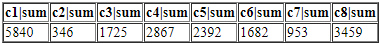
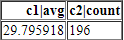

---
title: Gramex 1.55 release notes
prefix: 1.55
...

[TOC]

## FormHandler summarizes data

To get totals for any dataset, add `?by=` to the URL. For example,
[this link summarizes the flags data](../../formhandler/flags?_format=html&_by=)



Instead of sum, you can use average, count, min, or max for each columns. For example,
[?_by=&_c=c1|avg&_c=c2|count](../../formhandler/flags?_format=html&_by=&_c=c1|avg&_c=c2|count)
averages `c1` and counts `c2`.



You can also apply aggregations for subsets of data. For example,
[?_by=&continent=Europe](../../formhandler/flags?_format=html&_by=&continent=Europe)
shows the totals only for `continent=Europe`.


## UI component upgrades

g1 is upgraded from 0.16.1 to 0.17.0, which introduces
[$().template()](../../g1/template) subtemplates, and fixes a minor bug in
[$.formhandler](../../g1/formhandler) time zone handling.

Bootstrap-select has been updated to 0.13.10. This fixes bug [#138](https://github.com/gramener/gramex/issues/138).

Other UI components have also been updated to the latest patch versions.

## Other enhancements

- Log viewer now supports scrolling when the number of categories is long. It also supports custom data transforms [#160](https://github.com/gramener/gramex/issues/160)
- The Docker instance is based on Miniconda instead of the full Anaconda. This shrinks the image size (but it's still at ~2.5GB). This fixes [#81](https://github.com/gramener/gramex/issues/81)
- Documentation on [custom fonts](../../uicomponents/#custom-fonts) added [#124](https://github.com/gramener/gramex/issues/124)

## Bug fixes

- FormHandler date support for SQL filtering. Fixes [#146](https://github.com/gramener/gramex/issues/145) ([#149](https://github.com/gramener/gramex/pull/149))
- Preview for [alert-capture](../../admin/admin/alert) works. Fixes Fixes [#84](https://github.com/gramener/gramex/issues/84)
- Install SpaCy dependencies for CI [#159](https://github.com/gramener/gramex/issues/159)
- [Admin scheduler](../../admin/admin/schedule) displays all schedules, including those that didn't start on startup. The scheduler is also re-entrant -- so we can run multiple times in parallel. (This may not be a )

## Statistics

The Gramex code base has:

- 18,659 lines of Python
- 3,748 lines JavaScript
- 10,487 lines of test code
- 80% test coverage

## How to upgrade

To upgrade Gramex, run:

```bash
pip install --upgrade gramex
pip install --upgrade gramexenterprise    # If you use DBAuth, LDAPAuth, etc.
gramex setup --all
```
