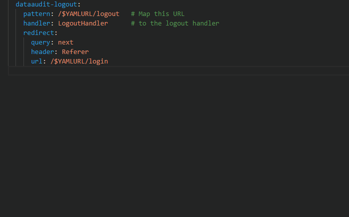

---
title: Snippets (Visual Studio Code Extension)
prefix: Snippets
...

[TOC]

A Gramex extension is available on [Visual Studio](https://code.visualstudio.com/). It features snippets for Gramex.

## Installation

In `Activity Bar` under `Extensions` tab search for `Gramex Snippets`. Alternatively, you can find the extension on [VSCode Marketplace](https://marketplace.visualstudio.com/items?itemName=gramener.gramexsnippets).

## How to use

In `gramex.yaml` or any `.yaml` file, type `grx-form`... It prompts `FormHandler` related snippets as suggestions.

There is an [auto-suggestion bug in VSCode](https://github.com/Microsoft/vscode/issues/27095) for YAML snippets. To work around this go to `Preferences -> Open Settings (JSON)` and add:

```JSON
    "editor.quickSuggestions": {
        "other": true,
        "comments": false,
        "strings": true
    }
```



Features will be updated rapidly, visit the [VSCode Marketplace](https://marketplace.visualstudio.com/items?itemName=gramener.gramexsnippets) to get the latest feature list.

- [CHANGELOG](https://github.com/gramener/gramex-snippets/blob/master/CHANGELOG.md) maintains release-wise changes
- Report bugs on [gramex-snippets](https://github.com/gramener/gramex-snippets/issues) repository
